# ArcGIS San Diego Airbnb Project

---

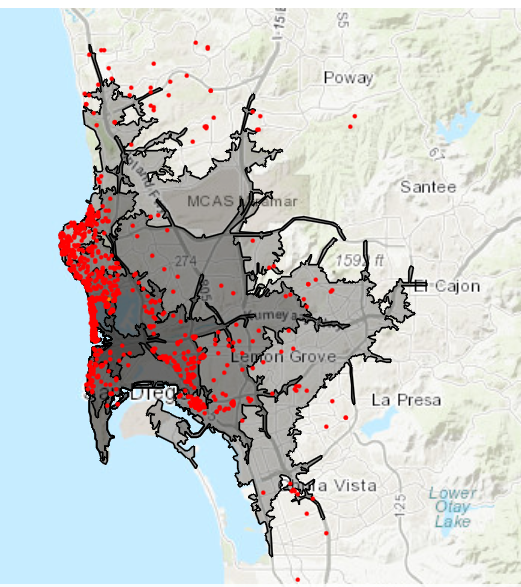

* [Areas with driving distances of 5, 10, 15, 20 minutes away from SeaWorld, along with locations of 1000 most expensive AirBnb listings]

---

* In this project, data analysis was done on Airbnb listings alongside geographic data using the GIS software ArcGIS.

# Table of Contents
- [Background](https://benduong2001.github.io/airbnb_sd.html#Background)
- [Airbnb Price Prediction](https://benduong2001.github.io/airbnb_sd.html#Airbnb-Price-Prediction)
- [Analyzing Airbnb Prices based on Distance from Landmarks](https://benduong2001.github.io/airbnb_sd.html#Landmark-Radius)
- [Map Visualizations](https://benduong2001.github.io/airbnb_sd.html#Map-Visualizations)

# Background {#Background}

* [Presentation](https://docs.google.com/presentation/d/1oIXAt-b-P-pWBr-IgK-vk3GEkhqwqTrLX_ksc_a72ME/edit?usp=sharing)

* [Github Repo](https://github.com/benduong2001/DSC170_Airbnb)

* A DSC170 Class Project with Tyson Tran. DSC170 is a class that covers spatial data science, and for our final project, we could do any topic of our choosing and do a project on it that uses ArcGIS's Python API. We decided to data analysis and machine learning on San Diego Airbnb listings. We analyzed the following:
    * Complex Geo-enrichment of zipcode census data including household income, and amount of leisuire businesses established, were all used to develop choropleth maps showing the geospatial relationships it had with the nearby AirBnb Locations by their price (overlaid as a scatterplot), highlighting that those closer to the beach were pricier.
    * Non-Spatial factors in the context of airbnb pricing.
    * Buffering of well-known city landmarks in proximity to these AirBnb's.
    * A linear regression model to predict Airbnb Listing Prices based on the surrounding geodata was trained, and achieved a near accuracy of 80%. Feature Importance bar-plots showed that Accomodation and various geo-enriched factors (such as amount of recreational and leisure businesses within the zipcode) were the most influential.

* **I contributed by**:
   * Creating and training the predictive model (Linear Regression with Python Scikit-Learn) that was able to estimate an Airbnb's listing price with a successful 80% accuracy, based on the geographic data of the Airbnb's surroundings
      * In doing so, I was also able to extract the most influential geographic business factors in determining an Airbnb's Listing price, and found out that it included aspects like the prevalence of nearby recreational businesses (fine dining, movie theaters, shopping), and prevalance of nearby hotels.
   * Creating map data visualizations that spatially assessed the Airbnb's listing price against buffered distances from specific tourist attractions.

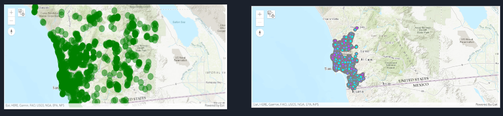

<!--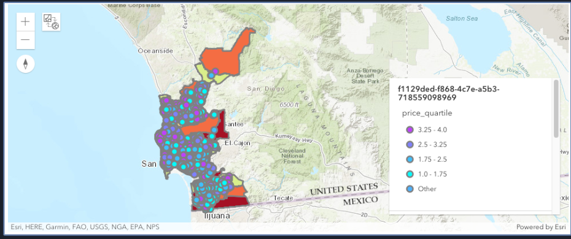

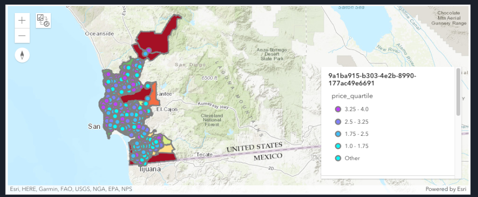

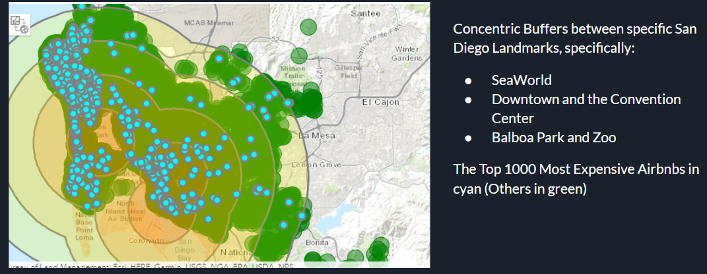
-->

# Prediction Model: Linear Regression in Scikit-Learn {#Airbnb-Price-Prediction}

* To summarize our results, the biggest factors affecting pricing in a positive or negative trend are location and size.
* In general, location and size are the biggest factors that affect the expenses of an investor because they have to pay more for a better location or a bigger home leading to a bigger mortgage each month or having to put more of their money out of pocket. The goal of an investor is to make a profit, so they would need to charge more if they have more expenses. When we look at the pricing of an Airbnb from tourist attractions, we can see that bigger tourist attractions do have an effect on the Airbnb pricing. If there are two properties of similar features near a large tourist attraction like the San Diego convention center but one is super close and one is further away, we would expect the closer one would be able to charge more. We also saw that homes that are able to accommodate more are able to charge more. Both of these findings are in line with our hypothesis.
* The Test Accuracy has a very promising correlation coefficient of 79%

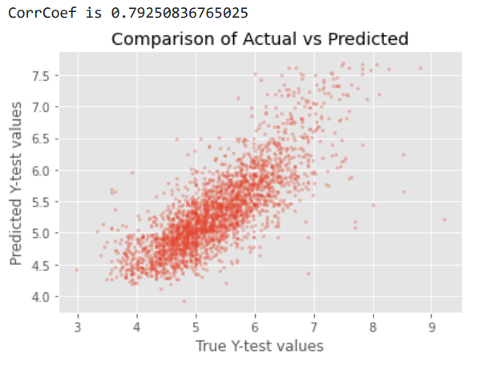

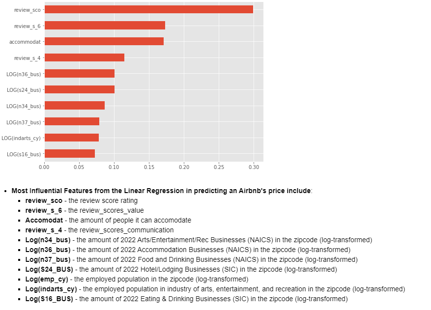

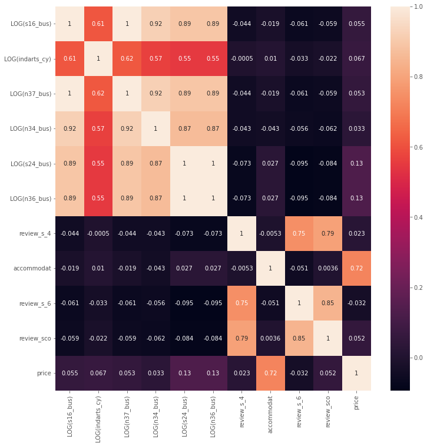

* There is a lot of multi-collinearity between the businesses columns

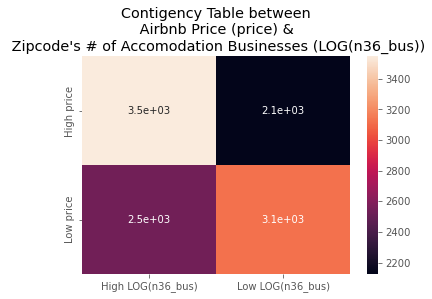

* There seems to be a direct relationship between the amount of accomodation businesses (Hotels, Motels, Inns, Hostels, etc). within the zipcodes and high airbnb pricing.

# Tourism Landmarks and Buffers {#Landmark-Radius}

* We decided to look at some concentric buffers around 3 specific, famous San Diego landmarks: 
    * SeaWorld, 
    * Convention Center, 
    * Balboa Park/the Zoo. 
* We have found that the airbnb's with the top 1000 highest prices tend to be within the closer buffer rings of these landmarks

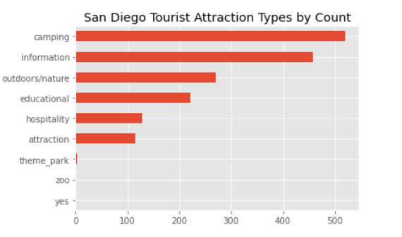

# Zipcode Choropleths against Airbnb Scatterplot colored by Pricing {#Map-Visualizations}

### Movie/Amusement Businesses  vs Airbnb Listing Price

* We want to take a look at how Amusement businesses affect the Airbnb listing price because families are more likely to visit areas with amusements for the kids. For example, there are many families from out of town and state that will fly to amusements such as Disneyland. This is a bigger example of something that families will go out travel to, but there are many smaller examples such as Legoland or the Zoo that families will go out of town to visit.

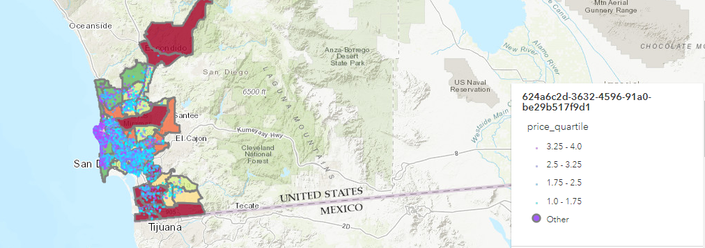

* While we thought there might be a correlation with these types of businesses and Airbnb listing prices, we do not believe that there is any correlation between the number of movie/amusement businesses in the area and the Airbnb pricing. We think that it is more likely for certain amusements to affect the Airbnb listing prices rather than just having a large amount in the area

### 2022 Median Home Value vs Airbnb Price

* We want to take a look at the median home value in the area versus the Airbnb listing prices in the area because if investors are investing in areas where it cost more to buy a property, we would expect the Airbnb listing prices to be higher in the area because they have more expenses to take care of and they are putting more of their money at risk.

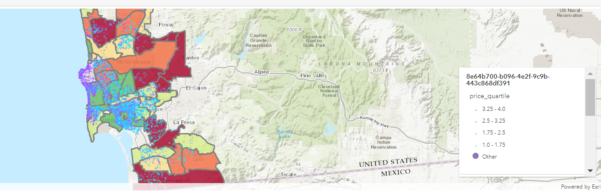

* This map confirms our beliefs as we can see this effect heavily on the coast where home prices are more expensive than inland areas. This shows that areas with a higher median home value do correlate with the Airbnb listing prices in the area. The most likely cause of this is that they are putting more money out to invest and to make a profit, they will need to take more money in.

### 2022 Hotel/Lodging Businesses vs Airbnb Price

* We want to take a look at the number of Hotel/Loding Businesses in an area vs the Airbnb listing price because Airbnb is also a lodging business. With a greater number of places for tourist to lodge in the area, there is more competition fighting to house tourist in the area and the prices should reflect that.

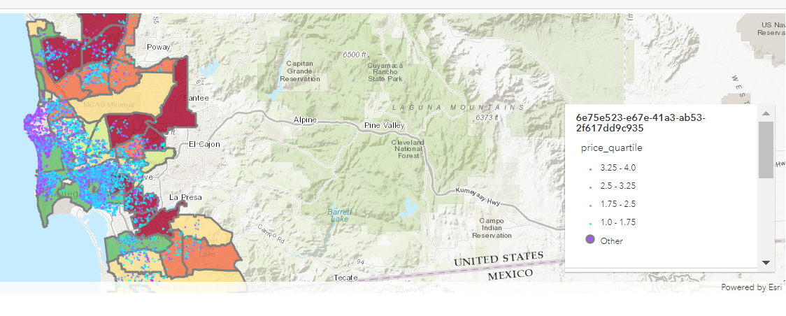

* We see that that there are areas that have high amount of lodging business also have high pricing for Airbnbs. This may be due to the fact that there is enough demand in the area that the prices can stay high even with a large amount of lodging businesses. In the areas with red which means that there are not much lodging businesses in the area, we can also see that those areas have high pricing such as in the 92127, 92129, 92130, which agrees with our hypothesis that areas with less lodging businesses can have Airbnbs that charge higher prices because of less competition

### 2022 Industry: Arts/Entertainment/Rec vs Airbnb Price

* We want take a look at if a more heavy entertainment area has anything to do with the Airbnb pricing. Generally people like to stay in an area where they can get some entertainment when they travel such as downtown areas like the Gaslamp area in San Diego. We believe that those areas with more entertainment options may be more desireable areas for tourist.

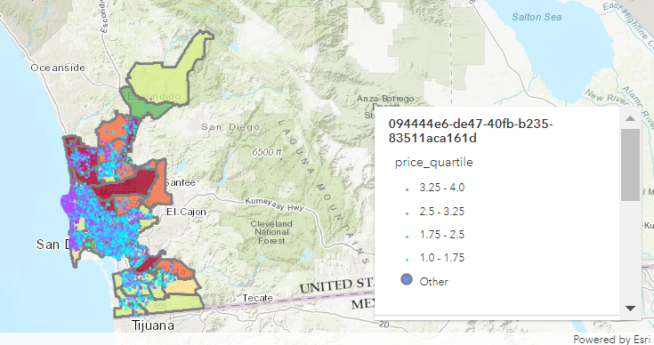

* We see that there is no correlation between the area being larger in the Arts/Entertainment/Rec industry and the Airbnb pricing for the area. We can see that there are not as many purple points in the green areas as compared to the yellow or red areas. The yellow and red areas are areas that have a smaller Arts/Entertainment/Rec industry than the green areas.
