# Offer Acceptance Industry Research Project

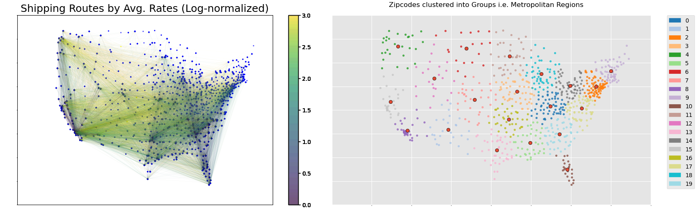

[(Click here for the actual website used for the project)](https://radumanea23.github.io/UCSDFlockFreightCapstone/)

<!--[(Github Repo)](https://github.com/benduong2001/DSC180Flock)-->

## Table of Contents
- [Background](https://benduong2001.github.io/capstoneproject.html#Background)
- [What I did](https://benduong2001.github.io/capstoneproject.html#Personal-Contribution)
- [Challenges Faced](https://benduong2001.github.io/capstoneproject.html#Challenges)
- [Visualizations](https://benduong2001.github.io/capstoneproject.html#Visualizations)

## Background {#Background}
* I was part of a 6-month industry research project with 3 other students, under the mentorship of Flock Freight, a delivery logistics company.
* I worked with Nima Yazdani, Radu Manea, and Keagan Benson.
* The background to Flock Freight's mission is:
  * A company needs to deliver an **order**  from Point A to Point B, but lack their own trucking or delivery services to do so.
  * Trucking Service companies, or "**Carriers**", are willing to give **offers** to deliver any shipments at a given cost
  * Flock Freight is the intermediary, or "Freight Broker", between both parties. 
    * For a given **Company X** in need to deliver **Order X**, a number of **N** carriers - ("**Carrier i**") will give offers ("**Offer i**") to deliver it for a certain cost a.k.a. shipping offer rate ("**rate i**"), where "i" is 1,2, 3....N.
  * And Flock Freight's questions are:
    * Knowing just Order X alone, predict N (the number of carriers that will make an offer).
    * Knowing just Order X alone, predict the cheapest offer rate the order might get.
* Flock Freight gave our team anonymized data that included those about the orders themselves, which were just: the origin and destination zipcodes (the zip3) of the shipment order,the date of deadline, and physical characteristics about it (i.e. whether it's hazardous, or needs refridgeration).
* After 20 weeks of intense collaboration and learning from Flock-Freight, my team and I constructed a final prediction model for determining if a given offer was worthy of selection. The new model was able to reduce Flock Freight's costs by 9.8%. 
* We also authored a project paper, and showcased our work to peers, college faculty, and industry professionals.

## Personal-Contribution {#Personal-Contribution}

**So what did I do?**
  * **Prediction Modelling and iteratively improving their accuracies**
    * Our team's final prediction model was actually a "conglomerate" of 3 prediction sub-models. Nima and I was responsible for **two** of them.
    * -
    * 
    * -
    * 
    * -
    * 
    * 
    * -
    * 

    * We had to work with building the models, finding more data for it, cleaning the data, feature engineering the data, training the model with it, and improving the model's test accuracy by either feature engineering the data even more or finding even newer data. Like a cycle.
    * These 2 models were:
      * A prediction model for the average of the offer rates for a given order. This would be used as a threshold to label any incoming offer as "cheap" if it is below-average for that order.
          - Final model: Linear Regression. 
          - Final test accuracy: 87%.
          <!--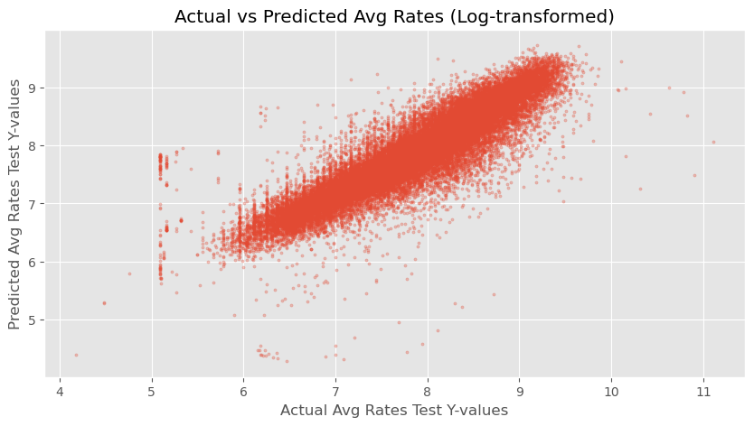-->

      * A prediction model for the standard deviation of the offer rates for a given order. This extends the last average model, labelling any incoming offer as "REALLY cheap" if below-average for that order by a large difference (namely that of the standard deviation). 
          - The initial baseline model had a poor test set accuracy of 57%. A big portion of the time went to **improving** this model's accuracy. Several weeks would be spent (see the next ["Challenges"](https://benduong2001.github.io/capstoneproject.html#Challenges) section) in a cycle of **asking questions to our industry mentor**, **data-cleaning**, **feature engineering**, **modeling**, **hyperparameter fine-tuning**, **peeking at EDA visuals (such as correlation matrix heatmaps to pinpoint correlated features)**. All of these eventually improved the model's accuracy and ROC AUC score by ~10%.
          - Final model: Random Forest
          - Final (and **improved**) test accuracy: 67%.
          <!---->
  * **Geo-Data**
    * Since this company dealt with transportation shipping, a lot of this project was geographical in nature.
     * The original Flock Freight data only had **one** geographic feature - the orders' origin and destination zipcodes.
    * Since I was the main person in the team with at least prior familiarity with geo-data in my internship and past projects, I had to do 2 tasks:
        1. Procuring external, geographic data sources for our project. 
        2. Transforming it to be "usable" or "pandas-dataframe friendly" and then pass the work to my other teammates so they could do more analysis on it.
    * How I did these 2 tasks were:
        1. I wrote **ETL** python scripts to extract this geo-data from online government census data sources.
            * Retrival is done by **Socrata API** by Tyler Insights, OR **webscraping** with **BeautifulSoup**, as a sequence of **"ETL Failsafes"** with Python's **Try / Except**.
            * The zipcode column  mentioned earlier would be the **"join key"** to these new "dimension tables"
        2. Geographic data preprocessing / Feature Engineering.
            * **GeoPandas** is used for geo-data pre-processing. To make the geodata usable as structured data, the zipcodes are mapped to X/Y coordinate columns.
            * But X/Y coordinates weren't enough, so I applied **K-means Clustering** to these zipcode nodes, and thus grouped them into "Regions" down to an amount suitable for **One-hot-encoding**.
            * Also, I decided to symbolize the order's **"Delivery Route"** by connecting each order's origin / destination zipcode nodes. I brought in further geodata sources and used GeoPandas's Intersection and Buffer methods to aggregate different information about the counties that the delivery routes crossed through. These included average population density, rainfall, etc. encountered during the shipping route for that order.
    * **Benefits**: 
        * These supplementary geographic features turned out to be very helpful for the feature engineering, and even influential for improving the prediction models' accuracies, compared to if we only limited ourselves to the pre-existing, non-geographic feature.
            * T-Tests coded in python showed that these features indeed had a statistical significance with respect to the offer rate standard deviation per order.  
        * By including this newfound geo-data, I was also able to let our team incorporate **geographic maps** into our data visualizations

  * **Impactful Insights**
    * I managed to uncover insights useful to Flock Freight's business case. Some will be mentioned again in the rest of this page, but several are:
       * With pandas data analysis, discovering the cheapest delivery offers frequently fell on Thursday, then checking its statistical significance with ANOVA testing.
       * Providing a geographic "segmentation" of the delivery hubs by applying unsupervised ML (K-means clustering) to the zipcode nodes's X/Y coordinates, thereby grouping them apart into 20 "metropolitan regions".
       * Producing data analysis on delivery data and uncovering:
          * Delivery routes with the cheapest shipments tend to be along the west-coast or in Florida.
          * Atlanta was a region of high delivery activity
          * Information about the order's delivery route itself, i.e. the average population density or weather road conditions (avg rainfall, temperature) of the counties encountered along the way, influenced on the demand of delivery offers for that order

* **Productionizing Data Pipeline**:
    *  As We had to improve the model's accuracy by routinely adding and cleaning new data or retransforming old data then re-training it, it was repetitive to re-run the tasks again and again through Jupyter Notebook to find which different configuration of factors boosted the model accuracy. And so I developed Python scripts to automate nearly all stages of my tasks into an end-to-end pipeline, that could be done in at least **6 to 8** commands on the terminal that can be put into a shell script, so that when those 6-8 commands were executed, the pipeline automatically did the following things:
        * Data retrieval from Socrata API and webscraping from online data sources using BeautifulSoup.
        * Data transformations using geopandas, feature engineering with pandas, and machine learning with sklearn pipelines to train and test multiple ML models.
        * Data cleaning tests using custom Python functions to ensure data quality and accuracy.
        * Recorded EDA and model metrics using Python logging and generated visualizations with matplotlib.
        * Updating of the image assets on own project's website with those generated visualizations.
        * Reproducibility of the project was ensured by creating a Docker Image, and containerizing our group's work.
  
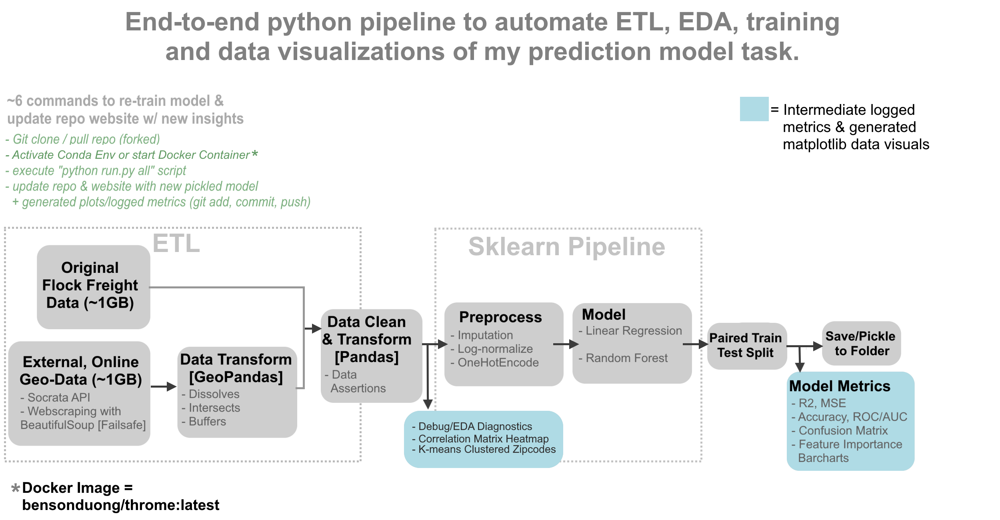

## Challenges {#Challenges}

**Challenges Faced & Overcoming Them**

This real-world project came with real-world **messy data** -full of nuances and imperfections that served as challenges. Not all of them had singular solutions, and needed a combination of several solutions.
* **Handling imbalanced data**: the target column for the standard deviation sub-model was highly imbalanced; it was a severely right-skewed distribution lower-bounded at 0 inclusive. This aspect inhibited the regression accuracy to have scores below even 50%.
  * **Redefining the target column**: in other projects, zero-bounded right-skewed distributions like these can be re-shaped into a bell-curve by log-transformation (Log(x+1)). But in this case, the column was still severely right-skewed after log-normalization. Several different combinations of transformation attempts led to dead-ends, and so I decided to ordinalize the column into 2 binary classes with a median threshold.
  * **Alternative Metrics to Accuracy**: Because of class imbalance, a high test set accuracy would be potentially deceiving since the model would just label everything as the majority class. For this reason, I had to use other metrics to assess the model, such as visualizing the confusion matrix or looking at ROC AUC Scores.
  * **Resampling of the imbalanced classes**. Under-sampling some of the over-represented classes (or vice versa) allowed for more equal representations during training.
  * **Sample weighting**: a reason as to why the target column was distributed like so, was because in many cases, Flock Freight closed many orders by picking offers too early; this meant the target column couldn't truly be representative of real-life data, and that for the observations that were "low" (i.e. on the left side of the distribution close to 0), it was impossible to tell if the value was truly low in real life... or if it could have been a potentially high value that was cut off too prematurely. For that reason, orders that were closed very early were given less trust or weight during the training and error.
* **Improving model accuracy**:
I employed various actions and improved the baseline model's accuracy from being 58% to 67%. These included adding further features, or doing further data-cleaning.
  * **Geographic Features**: as mentioned previously, adding geographic features helped the accuracy.
  * **Time-based Features.** 
     
## Visualizations {#Visualizations}

* These are some of the visualizations made by me, using Python's matplotlib.

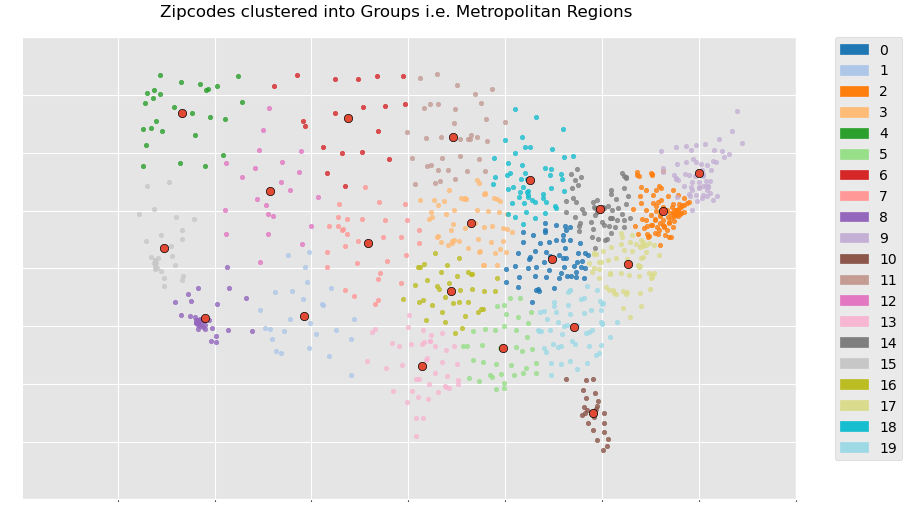

* Clustering (K-means) on the zipcode nodes allows us to group them apart into "metropolitan regions", providing a geography-based "segmentation" of the shipping locations to symbolize locality / take advantage of spatial autocorrelation. 

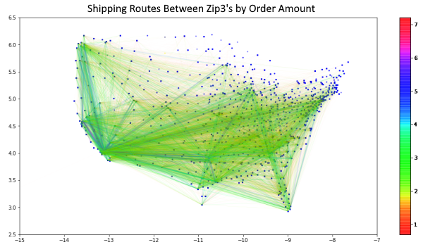

* This delivery route network map between the zipcode nodes gives the traffic or "amount of orders observed" along the delivery route.
* Southern California, Bay Area, New York, Seattle, Chicago, Florida, Atlanta, Dallas, seem to be very prominent centers.

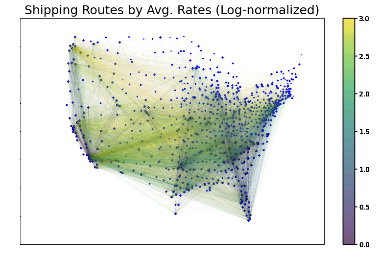

* This delivery route network map between the zipcode nodes give the average offer rates of orders that occured along the delivery route.
* It seems that the cheapest average offers rate tending to be along the west-coast states or from in/out of Florida.

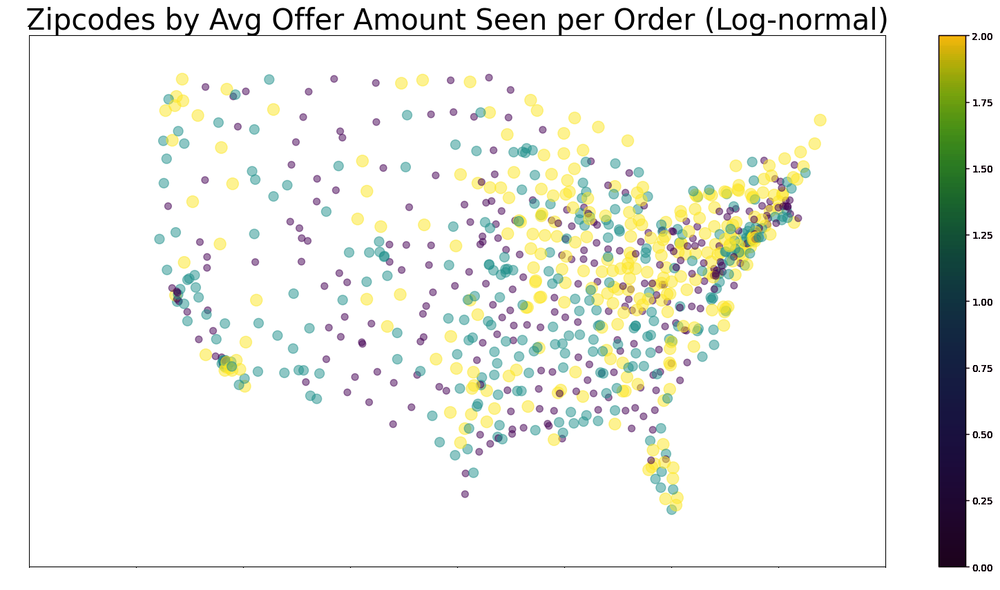

* This zipcode scatterplot gives the average offer amount per orders of given zipcode nodes (whether they were the origin or destination zipcode).
* It seems that the Great-Lakes Area and the Northeast seems to be a region that shows up a lot as the destination or origin zipcodes in orders with a high number of offers.

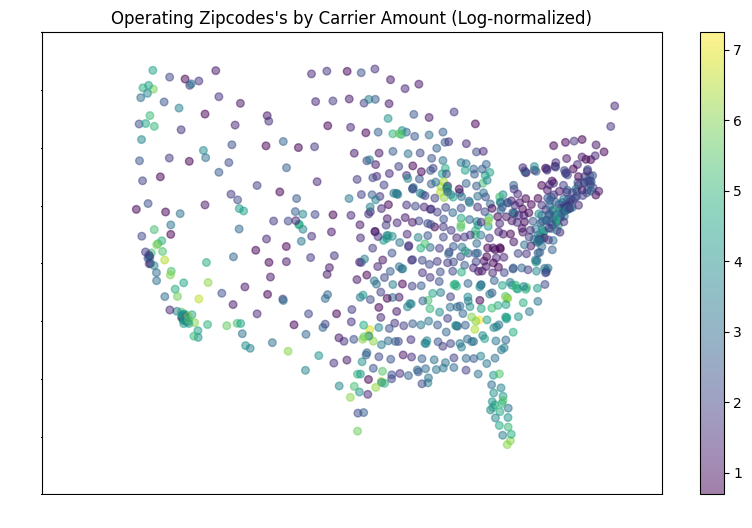

* This zipcode scatterplot counts how many carriers are based in different zipcode nodes
* While maps like these tend to show obvious population centers, that might not be fully the case here; for example, regions that should typically be very populated seem to have few or even 0 hubs: The Great Lakes area only has Chicago; meanwhile, NYC + the "BosWash" area (https://en.wikipedia.org/wiki/Northeast_megalopolis) seem to be almost nonexistent in this map!

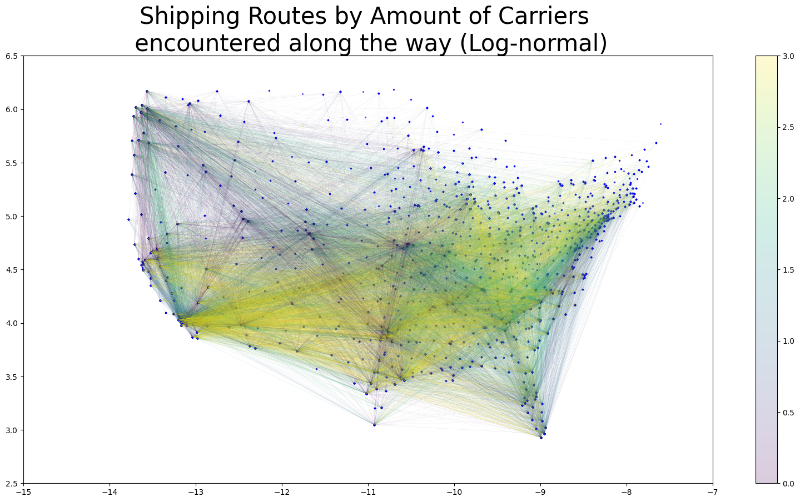

* This delivery route network map between the zipcode nodes gives the amount of "operating zipcodes" (a.k.a. a carrier's home zipcode) orders that occured along the delivery route.
* The purpose of such a map is to see if it can symbolize "competitive" a delivery route tends to be; we expected that for delivery routes that go through the "jurisdictions" of many carriers will have a lot of competition for a given order, potentially driving down the offer rates.

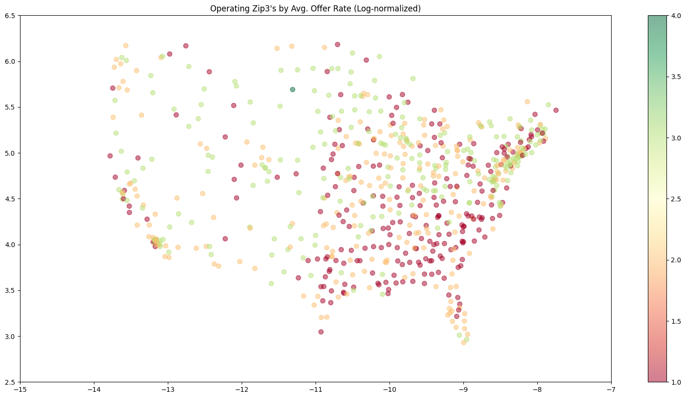

* This zipcode scatterplot weighs each "operating zipcode" (a.k.a. a carrier's home zipcode) by their average offer rates 
* It seems like for a given offer, if the carrier proposing it is in the South, their offer rate might be very cheap.

### Prediction Model Visuals

* This scatterplot gauges the accuracy of the first prediction sub-model that I worked on, which estimates the typical offer rate for a given order.
* Even with just a Linear Regression (Scikit-learn), I was able to achive 87% test accuracy; In this scatterplot,the true test-set y-values are compared against the predictions made by the linear regression, showing high accuracy because the cloud of dots are almost very straight and linear.

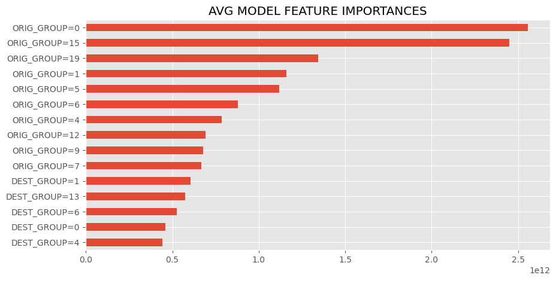

* This barchart ranks the most influential features in the first prediction sub-model, which I got by getting the absolute values of the linear regression coefficients. In this case, the column name format "ORIG_GROUP=X" means if the order's origin zipcode node is in group "X" (see the metropolitan regions visualization). Likewise, "DEST_GROUP=X" means if the order's destination zipcode node is in group "X".

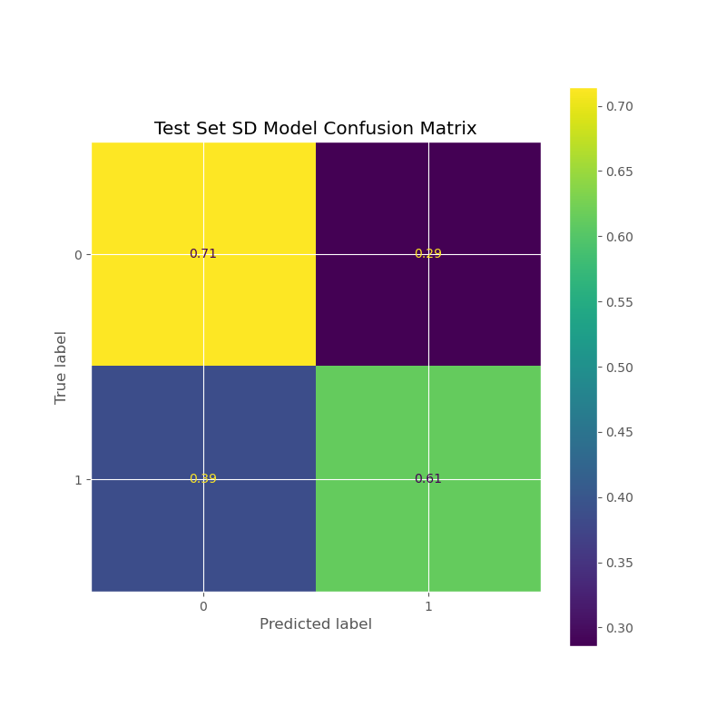

* This confusion matrix is for the second prediction sub-model that predicts the standard deviation of the offer rates for a given order (or more specifically, whether it's "high" or "low").

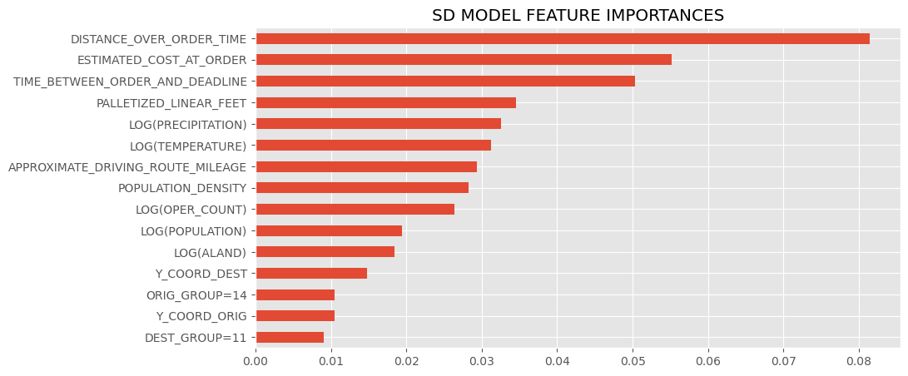

* This barchart ranks the most influential features in the second prediction sub-model, which uses the ".feature_importances" attribute of the sklearn model.
* It seems having geographic features is very important to the model's accuracy, as many of these features pertain to information about the order's delivery route.
    * Several pertain to the delivery route's road or weather conditions:
        * LOG(POPULATION): the average population of all the counties that the order's delivery route crosses through
        * LOG(ALAND): the average land-area of all the counties that the order's delivery route crosses through
        * LOG(PRECIPATION): the average precipitation (rainfall or snowfall) of all the counties that the order's delivery route crosses through
        * LOG(TEMPERATURE): the average temperature of all the counties that the order's delivery route crosses through
        * POPULATION_DENSITY: the average population density (or urban-ness) of all the counties that the order's delivery route crosses through
        * APPROXIMATE_DRIVING_ROUTE_MILEAGE: the length of the order's delivery route (the euclidean distance between the origin and destination zipcode node)

### PowerBI Visuals {#PowerBI-Visuals}

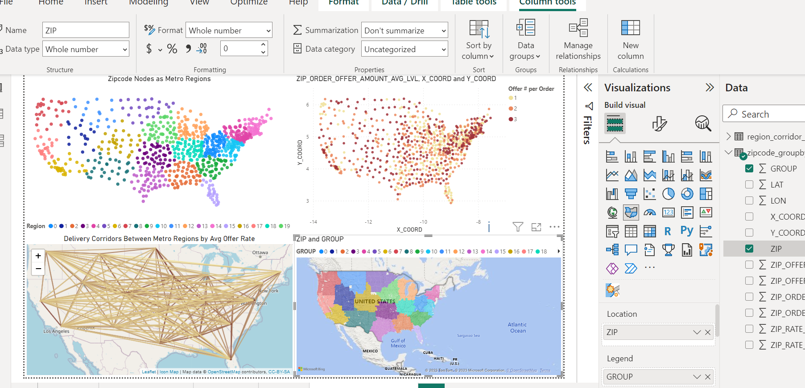
* PowerBI dashboard hooked to DuckDB
