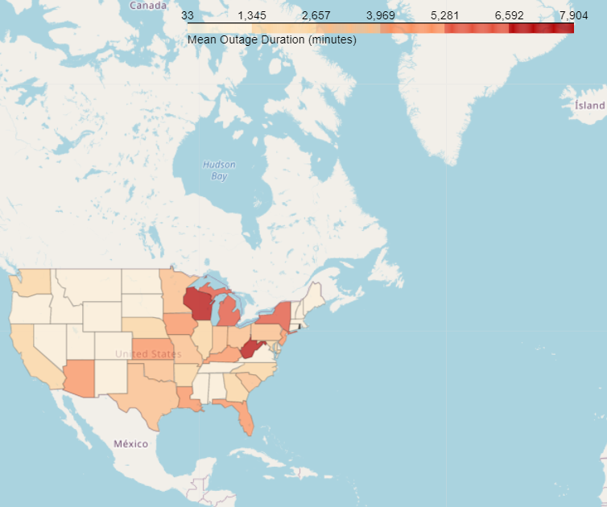

# DSC80 Power Outage GeoSpatial Data Science Project

 

[Github Repo](https://github.com/benduong2001/geospatial_power_outages)

* For our DSC80 Class at UCSD, I had to do a final class project. I decided to on a power outage dataset.
* The endgoal would be a regression model where given a power outage, one could predict the percentage of customers in that state that would be affected by said power outage. 
    * Data-Cleaning and Data Quality Tests with Domain research
        * Manually re-grouping of incorrectly grouped states in their labeled NERC regions
        * Data-cleaning in terms of incorrect date-times
        * Grouping features apart into separate lists by their utility types (Categorical, Numerical, Boolean); This is to prepare the column names lists as inputs for separate Sklearn Pipelines according to their data types later on.
    * Exploratory Data Analysis
        * Interactive Geographic Map Data Visualization with the **Folium** package, including a choropleth map showing states by average outage duration
        * Exploration of the Correlation Matrix Heatmap against the Target Variable. This was also an informal and preliminary feature selection, as I used this to take note of potentially useful features of high absolute correlation, and look out for features of multi-collinearity - since population bias might be matter of concern in a dataset like this.
        * Numerous other EDA tables and charts, such as those showing outage spikes by months for different climate regions.
    * Feature Engineering
        * Using Sklearn Pipelines and Column Transformers
        * Log-Normalization for several severely right-skewed non-negative features.
        * One-hot-encoding of categorical features
        * Dimensionality Reduction with PCA
    * Model Selection and Evaluation
        * Linear Regression was the model of choice
        * Hyper-parameter fine-tuning with GridSearchCV
        * Remarkable Model Accuracy Improvement: I achieved an 80%-90% correlation coefficient accuracy, compared to the original accuracy of the baseline model (around 50%), all thanks to the efforts of the feature engineering.
        * Fairness Test using Hypothesis Testing: Permutation T-Testing confirmed that this final model is also fair for both urban vs rural states   

