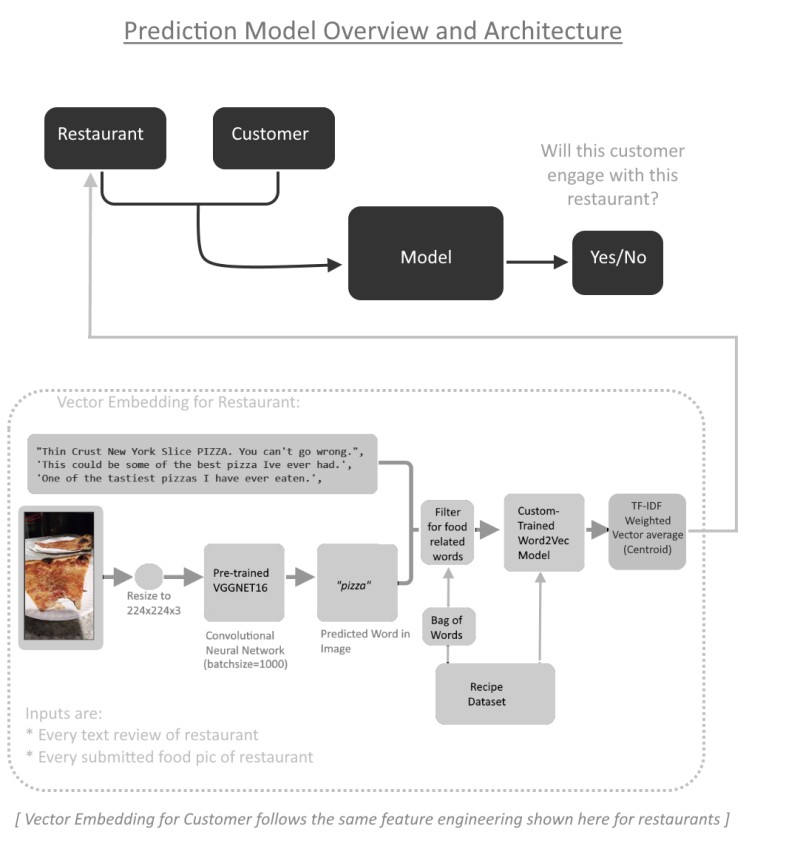
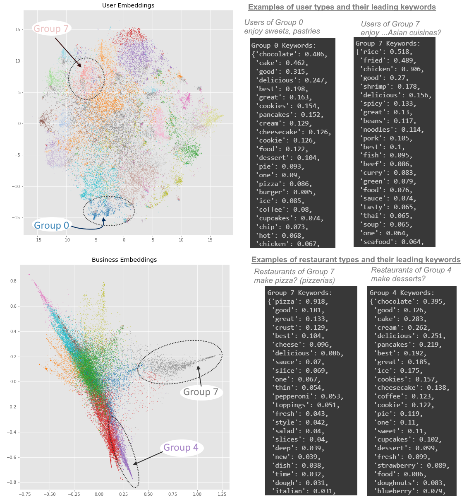

# Food Recommendation Data Science Project

[(Click here for a more in-depth and ML-technical description of this project!)](/food_recommendation_technical.md)

[(Link to Github Repo)](https://github.com/benduong2001/Food-Recommendation)

* This independent data science project of mines, explores food related datasets (unstructured text data) for prediction data analysis tasks involving customer recommendation. Two tasks or "sub-projects" were done
* This project will show:
   * Data Analysis and results applicable to useful business questions on customer recommendation, such as providing insights to user demographic sub-groups.
   * Succinct and Intuitive Data visualizations

   * Used Tools (Everything is done in Python)
       * Scikit-learn (for TfIdf Vectorizer and Logistic Regression)
       * Matplotlib for visualizations
       * NumPy
       * Tensorflow and Keras

### Sub-Project 1

* Task 1 is about predicting whether a given user will rate a given restaurant negatively, with their text reviews as input data.
* [Click here to see the full "sub-project" 1](https://benduong2001.github.io/food_recommendation_part1.html)

 

## Sub-Project 2

* Task 2 is about predicting whether a given user likely would visit a given restaurant, using text and images as input data.
* [Click here to see the full "sub-project" 2](https://benduong2001.github.io/food_recommendation_part2.html)

 

* Gensim's Word2Vec would be used to be provide vector embeddings for the restaurants and reviewers

 

* By doing so, unsupervised ML clustering (namely K-means) via Python's Scikit-Learn can be used to automate customer segmentation. This divides the reviewers into distinguishable ”cuisine” sub-groups based on their reviews’ distinct food-related keywords (the same applies to the businesses)
* For data visualization purposes, the data undergoes dimensionality reduction as seen below to enable a 2D scatterplot.
 

* During the data preparation, I was also able to uncover indirectly-associated sub-groups in the restaurants and customer demographics, based on food, which in itself is a useful and applicable byproduct. 
