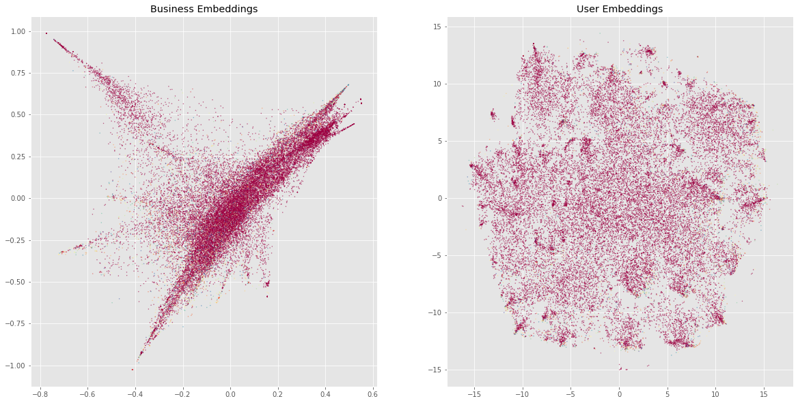
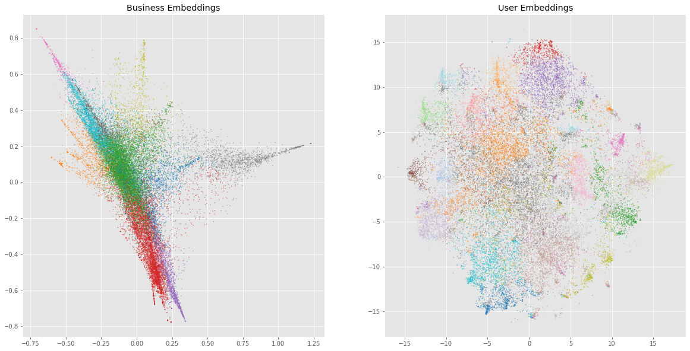

# Food Recommendation Data Science Project

* This Data Science project explores food related datasets for tasks involving customer recommendation:
* 
* 

## Restaurant Rating Prediction given User Text Reviews
* This sentiment analysis prediction will predict whether a user's rating for a restaurant is negative, given the text data of their google review.
* For this task, deep learning, 
* In-depth Feature Engineering will be all that is needed to transform unstructured text data into explainable and structured, tabular data. 

#### **Data Preparation and Feature Engineering**

* 

#### **Modeling, with Class Imbalance Undersampling**
* Logistic Regression was used. However, the target data had class imbalance where good ratings were over-represented. There are probably some explanations behind this (maybe users tend to be polite or optimistic). To address this, 10 models were trained separately, where each model's training data had to under-sample the over-representative good ratings. These 10 models had each of their coefficients normalized for equal scaling, and each coefficient across the 10 models was averaged, (alongside the intercept).

#### **Results and Evaluation**
* The results on the test data showed that this prediction had a remarkable 79% accuracy in determining if a user would rate a restaurant as good or bad based on their google review; 
* The confusion matrix also showed that the undersampling procedure fixed the class imbalance; had this not been done, the prediction model would have just given almost every review a good rating.

 

* Finally, a peek at the 20 strongest coefficients of the prediction model, and their corresponding words.
* In other words, the presence of these following words in a google review are heavily associated with a user giving a restaurant a **bad rating**. 

 

* This makes sense, as most of these words have negative connotations, and even more impressively, it manages to pick out words that aren't just negative "emotional" words (like worst, or bland)- it also includes words that are otherwise arguably neutral but deemed negative *in the context of food at a restaurant* (overpriced, burnt, dry, cold)
* This demonstrates our intricate feature engineering process was successful in extracting meaningfulness from the unstructured text data of the google reviews.

## User - Restaurant Interaction Prediction 

* This task determines how likely a given user would dine a given restaurant (regardless if their eventual opinion), based on the user's history of previosuly chosen restaurants (if available) and the restaurant's history of customers, or [***collaborative filtering***](https://en.wikipedia.org/wiki/Collaborative_filtering).
* Unlike the previous task, this one will employ more advanced deep learning and pre-trained ML tools. 

#### **Word2Vec**
* Gensim's Word2Vec model can make vector representations for a vocabulary of words.
* One of Word2Vec's fun features is the ability to do "arithmetic" with words. For the custom food dataset vocabulary that we trained Word2Vec on, we expect things like "barbeque - july 4th + thanksgiving" to equal "turkey" (i.e. July 4th is to barbeque, as Thanksgiving is to turkey). 

 

* The vector representation of a restaurant is obtained by getting the "average vector" (or centroid) of the Word2vec vector representations of the words seen in that restaurant's reviews. For exploratory purposes, it's also nice to check the word that "represents" a restaurant - which is just the word whose vector representation to that average vector.
* Sometimes, that representative word is very obvious, being a very frequently appearing word in the reviews (like pizza)

 

* Other times, it is a subtle word that might not even have appeared in the reviews at all. For this restaurant with only 1 review, it was deemed mediterranean, even though the word mediterranean is nowhere to be seen. Only 1 word might have tipped it to that label - "Gyro"

 

#### **Clustering**

* After doing this, each restaurant should have its own vector representation; the same could be done to each user. This can be mapped to scatterplots (made with TSNE): each point in space on the left scatterplot is a restaurant, while on the right are users. 
* Furthermore, it is possible to group up the vector representations

 

* By using k-means clustering, we found a way to group the restaurants based on the textual content of their reviews, and group the users by the textual content of the reviews they've written.

 

