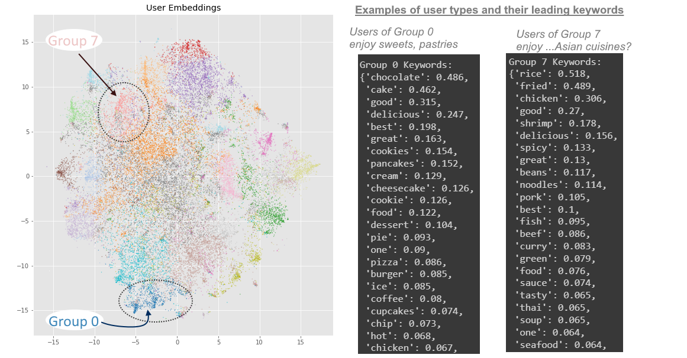

# Food Recommendation Data Science Project

* This Data Science project explores food related datasets (unstructured text data) for prediction data analysis tasks involving customer recommendation: 

* This project will show:
   * Articulately-reasoned Feature Engineering on transforming unstructured data (text) into tabular, structured data to train logistic regression on using NLP techniques (Word2Vec and Tf-Idf).
   * Data Analysis and results applicable to useful business questions on customer recommendation
   * Predictions models with promising results and accuracy
   * Succinct and Intuitive Data visualizations
   * A balanced use of both basic machine learning (e.g. Sklearn logistic regression) vs deep learning (e.g. multi-layered neural networks, pretrained models)- understanding when either should be used appropriately, thereby seeing their pro's and con's.
   * Python code that includes object oriented programming, and pyspark.

## **Restaurant Rating Prediction given User Text Reviews**
* For this 1st task, a basic sentiment analysis model will be made and trained to predict whether a user's rating for a restaurant is negative or not, given the text data of their google review.
* In-depth Feature Engineering will be all that is needed to transform unstructured text data into explainable and structured, tabular data. 

#### **Data Preparation and Feature Engineering**

1. Preprocessing was done on the review text column like lowercasing, and replacement of non alphanumeric characters with whitespace.
2. TF-IDF vectorization was done on the processed review text column, dropping  NLTK’s English stop-words list. This produced a matrix with column count as the
vocabulary size. 
3. The review rows of the new TF-IDF matrix were grouped separately by the corresponding binary rating category. 
4. Then within each group, the rows were collapsed with a column-wise mean (i. e. np.mean with axis = 0). This produced a new matrix that had a row count of 2 and a column count of vocabulary size.
5. Do a column-wise argmax (i. e. axis = 0) on the new array, and filter only for the columns where the argmax row index corresponds to the category for bad ratings. Use these column indices and the vocabulary mapping of the saved TF-IDF vectorizer object to retrieve the words.
6. The previous steps basically filtered for the words that have a stronger "belongingness" to bad reviews compared to good reviews, using TF-IDF. But now, it was decided that among these words, only 100 is needed. While all of these words have stronger relevance to bad reviews, some are  stronger than others, so these words are sorted by the largest absolute difference (between the 2 rows), and the topmost 100 got picked.
7. With these 100 words, and typical bag-of-words count vectorized matrix was produced upon the original reviews dataset, and serves as the input matrix to the model.

#### **Modeling, with Class Imbalance Undersampling**
* Logistic Regression was used. However, the target data had class imbalance where good ratings were over-represented. There are probably some explanations behind this (maybe users tend to be polite or optimistic). To address this, 10 models were trained separately, where each model's training data had to under-sample the over-representative good ratings. These 10 models had each of their coefficients normalized for equal scaling, and each coefficient across the 10 models was averaged, (alongside the intercept).

#### **Results and Evaluation**
* The results on the test data showed that this prediction had a remarkable 79% accuracy in determining if a user would rate a restaurant as good or bad based on their google review; 
* The confusion matrix also showed that the undersampling procedure fixed the class imbalance; had this not been done, the prediction model would have just given almost every review a good rating.

 

* Finally, a peek at the 20 strongest coefficients of the prediction model, and their corresponding words.
* In other words, the presence of these following words in a google review are heavily associated with a user giving a restaurant a **bad rating**. 

 

* This makes sense, as most of these words have negative connotations, and even more impressively, it manages to pick out words that aren't just negative "emotional" words (like worst, or bland)- it also includes words that are otherwise arguably neutral but deemed negative *in the context of food at a restaurant* (overpriced, burnt, dry, cold)
* This demonstrates our intricate feature engineering process was successful in extracting meaningfulness from the unstructured text data of the google reviews.

## **User - Restaurant Interaction Prediction**

* This 2nd task determines how likely a given user would dine at a given restaurant (regardless if their eventual opinion), based on the user's history of previosuly chosen restaurants (if available) and the restaurant's history of customers. In other words, [***collaborative filtering***](https://en.wikipedia.org/wiki/Collaborative_filtering).
* Unlike the previous task, this one will employ more advanced deep learning and pre-trained ML tools. 

#### **Word2Vec**
* Gensim's Word2Vec model can make vector representations for a vocabulary of words.
* One of Word2Vec's fun features is the ability to do "arithmetic" with words. For the custom food dataset vocabulary that we trained Word2Vec on, we expect things like "barbeque - july 4th + thanksgiving" to equal "turkey" (i.e. July 4th is to barbeque, as Thanksgiving is to turkey). 

 

* The vector representation of a restaurant is obtained by getting the "average vector" (or centroid) of the Word2vec vector representations of the words seen in that restaurant's reviews. 
* For exploratory purposes, it's also nice to check the word that "represents" a restaurant - which is just the word whose vector representation is closest to that average vector.
* Sometimes, that representative word is very obvious, being a very frequently appearing word in the reviews (like pizza)

 

* Other times, it is a subtle word that might not even have appeared in the reviews at all. For this restaurant with only 1 review, it was deemed mediterranean, even though the word mediterranean is nowhere to be seen. Only 1 word might have tipped it to that label - "Gyro"

 

#### **Unsupervised ML: Grouping Apart the Restaurants and Users with K-Means Clustering**

* After doing this, each restaurant should have its own vector representation; the same could be done to each user. This can be mapped to scatterplots (made with TSNE): each point in space on the left scatterplot is a restaurant, while on the right are users. 
* Furthermore, it is possible to group up the vector representations

 

* By using k-means clustering, we found a way to group the restaurants based on the textual content of their reviews, and group the users by the textual content of the reviews they've written.

 

* While this is not necessary, it would be insightful to actually see what kinds of groups these mean for restaurants and users. Using TF-IDF on the words that show up in each group's collection of reviews, the leading keywords are extracted. Examples are shown

 

 

* The overarching direction of this project is to connect user-types to restaurant-types. For example, restaurants of Group 4 tends to make desserts (sweets, confectionery, pastries), and users of group 0 tends to eat mostly desserts. Ideally this project seeks to connect these dessert-lovers to these dessert restaurants.

#### **Prediction Modeling: Binary Classification**

* Finally, the last part is to create a prediction model that answers whether or not a given user is likely to interact with a given restaurant... with the underlying data being based on the types of food that the given restaurant serves and the types of food the user has eaten at other restaurants.
* 2 different model versions will be created and trained towards the same goal of binary classification: a regular single-layered logistic regression with Sklearn; and a Multi-layered Deep Neural Network with TensorFlow
* For this interaction problem, it is necessary to manually create "artificial, unseen" pair; every user-restaurant pair in the dataset is real and observed, so there is no "negative" samples to work with. An elaborate sampling procedure was developed that tries to find never-before-seen (thus negative) combinations of users and restaurant, in a way that tried to be natually random as possible. This of course brings into consideration an unspoken assumption that the given dataset is an extremely accurate representation of real life; in other words, we are assuming there is no cases where the artificial pairs we created actually do exist in real life but weren't in the dataset.
* After creating the negative samples (roughly the same amount as positive samples), a 2D PCA scatterplot was created to verify that the artificial samples were almost naturally random as intended (showing that they are perfectly similar as 2 indistinguishable, overlapping clouds of points - blue and green)

 

* The input matrix is basically concatenating the user and restaurant embeddings from earlier for each pair. Since the embedding sizes for the user and restaurant were both 100, the input matrix's shape is N rows by 200 columns, where N = the number of "real, observed" samples + "artificial, unseen" samples.

**Logistic Regression**

* For metrics of the Logistic Regression as the prediction model, it is around 60% accurate in correctly determining whether or not a given user has visited a given restaurant.
* This score isn't awful, but clearly not good enough either; nevertheless, it is a good starting point open to more adjustments to the model; for example, the embedding sizes of the user and restaurants Word2Vec vector representations can be increased from 100 to 1000 dimensions (for a 2000 dimensional matrix)

 

**Multi-Layered Neural Network**

* This model uses 3 layers (2 ReLU, 1 sigmoid), with Binary Cross Entropy Loss.
* For metrics of the Multi-Layered Neural Network as the prediction model, it is around 70% accurate in correctly determining whether or not a given user has visited a given restaurant.
* While this metric is clearly an improvement from the logistic regression, it is not far enough of a jump in improvement. At this stage, it is wise to see if using Deep Neural Networks over Logistic Regression run into diminishing returns.

 

