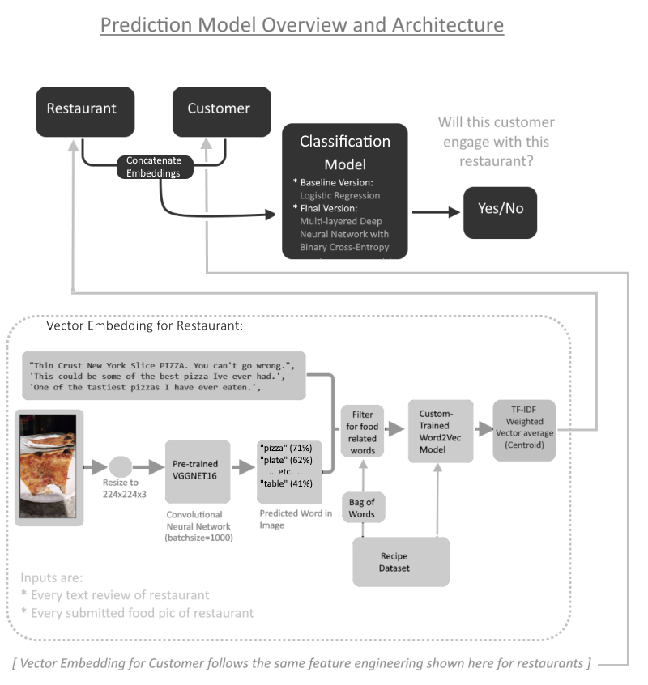

# Food Recommendation Data Science Project

[(**Click here for a more in-depth and technical version of this page!**)](/food_recommendation_technical.md)

* This independent data science project of mines, explores food related datasets (unstructured text data) for prediction data analysis tasks involving customer recommendation. Two tasks or "sub-projects" were done:
    * Task 1 is about predicting whether a given user will rate a given restaurant negatively, with their text reviews as input data.
    * Task 2 is about predicting whether a given user likely would visit a given restaurant, using text and images as input data.
       * During the feature analysis, the unsupervised ML code also serendipitously uncovered indirect associations shared amongst users and restaurants (that would have been too subtle for a human analyst to notice), allowing a automated way to divide the users and restaurants demographic into indirect sub-groups, based on the types of restaurants they visit and the types of customers they get -respectively. 

* This project will show:
   * Articulately-reasoned Feature Engineering using NLP techniques (Word2Vec and Tf-Idf), to transform unstructured text data into a structured tabular format, so that it can be compatibly trained with linear models as baseline (specifically logistic regression).
   * Data Analysis and results applicable to useful business questions on customer recommendation, such as providing insights to user demographic sub-groups.
   * Succinct and Intuitive Data visualizations
   * A balanced use of both basic machine learning (e.g. Sklearn logistic regression) vs deep learning (e.g. multi-layered neural networks, pretrained models)- nuanced understanding when either should be used appropriately, thereby seeing their pro's and con's.
   * Python code that includes object oriented programming, and Pyspark. It is also designed in a way to be updateable, and extensible for new incoming data

[(Link to Github Repo)](https://github.com/benduong2001/Food-Recommendation)

## **Sub-Project 1: Predicting How a User Rates a Restaurant Rating Based on Their Review**

* For this 1st task, I created a prediction model that determines whether a user's rating for a restaurant is negative or not, given the text of their review.

### **Data Preparation**

* The main idea of the data preparation is that it finds a set of keywords whose presence (or absence) in a given user's review for a restaurant will determine how the user rates it. For this prediction model, the plan is to look for the keywords that are "bad", and their presence indicates a negative rating, while their absense might indicate a positive rating.
* To find said "negative" keywords, I took a large set of reviews, and separated them into 2 groups based on if their associated ratings was good or bad.
* Then I employed the TF-IDF method, which is supposed to find the most "distinctive" groupwise keywords of either groups (keywords that show up more often within a group, compared to outside that group). This is resting on the expectation the most "distinctive keywords" of the bad-ratings group is mostly going to be "emotionally negative" words.

### **Results and Evaluation**

* The results on the test data showed that this prediction had a remarkable accuracy in determining if a user would rate a restaurant as good or bad based on their text review; 
* This metrics table means that out of the times where a user rates the restaurant positively, it is able to correctly predict that the rating was positive 86% of the time, based on the user's review; out of the times where a user rates the restaurant negatively, it is able to correctly predict that the rating was negative 86% of the time, based on the user's review; 

 

* Finally, a peek at the 20 most influential keywords to appear in a google review, in determining if a user will give a restaurant a **bad rating**. 

 

* This makes sense, as most of these words have negative connotations, and even more impressively, it manages to pick out words that aren't just negative, "emotional" words (like worst, or bland)- it also includes words that are otherwise arguably neutral but deemed negative *in the context of food at a restaurant* (overpriced, burnt, dry, cold)
* 

## **Sub-Project 2: Predicting if a User will visit a Restaurant**

* This 2nd task on user-restaurant determines how likely a given user would dine at a given restaurant, based on the user's history of previosuly chosen restaurants (if available) and the restaurant's history of customers. In other words, [***collaborative filtering***](https://en.wikipedia.org/wiki/Collaborative_filtering).
* Unlike the previous task, this one will employ more advanced deep learning and pre-trained ML tools. 

### **Overview**

* The model should take a given user and a given restaurant as input, and output a value between 1 and 0 if the user will visit and eat at that restaurant (or not).
* The information of each user is summarized using a language-based model tool called Word2Vec, with the information being all of the food-related words that showed up in the reviews written by the user. Essentially, each user is represented by the food they review.
* The information of each restaurant is also summarized using Word2Vec, but in this case, they are represented by the food they serve.

 

* This graph visually summarizes the model architecture. As one can see, 80% of my time is actually for the data preparation and cleaning, while the prediction model itself is merely a 20% part at the end.

### **Word2Vec**

* In order to approximately select only the food-related words, I used a completely separate dataset: a recipe dataset where one of the columns was a list of ingredients for each recipe; while it's impossible to get a universal list of every food-related word that exists, this is sufficient enough to build a vocabulary of just food words.
* A reason behind my choice to use Word2Vec is its ability to connect relationships between words that usually appear close to one another. This is useful because it allows **indirect associations** between 2 given words.
   * Let's say there is a user who mostly eat seafood, but the word "seafood" never shows in their reviews. Despite being so, they can still be associated with seafood based on the seafood-related words in their reviews ("salmon", "crab", etc.), because there are many other sentences in the dataset that do in fact have the word "seafood" and the said seafood-related words showing up close to each other, which is how the association is lerned from.
* So now, a column where each row is the ingredients list for a recipe, is an effective learning place for the Word2Vec to bridges associations between food words based on their co-occurences.

* One of Word2Vec's famous features is the ability to do "arithmetic" with words. Think of it like the analogy questions of old SAT exams. For the custom food dataset vocabulary that we trained Word2Vec on, we expect things like "barbeque - july 4th + thanksgiving", which basically asks **"If July 4th is to barbeque, then Thanksgiving is to ...?)."**. The top leading words are related to **turkey**. 

 

* For exploratory purposes, it's also nice to check the word that "represents" a restaurant.
* Sometimes, that representative word is very obvious, being a very frequently appearing word in the reviews (like pizza, for this restaurant)

 

* Other times, it is a subtle word that might not even have appeared in the reviews at all. For this restaurant with only 1 review, it was deemed "mediterranean", even though the word "mediterranean" is nowhere to be found. Only 1 word may have been all that was needed to tip it to that label - "Gyro" (a Greek dish).

 

### **Image Recognition**

* Some of the reviews comes with images of the food submitted by the users; this could be fed through a "convolutional neural network", an image recognition model which is a tool that can label the objects seen in a given picture. These labels are then filtered to only get food-related words using the food vocabulary as made by the recipe dataset. These words are attached to the text review as though it was part of the review.
   * For example, if an image in a review is a picture of a cupcake on a plate on a table by a window, the VGGNET16 model might output the top predictions as "cupcake", "window", "table", "plate". Assuming that the food vocabulary I created is large enough to include the word "cupcake", then that would be the only word that will be used from the image.
* The python code accomodates this procedure, but I switched off for the baseline model since it's computationally costly.

### **Dividing the Restaurants and Users into Distinct Sub-groups**

* With further processing of the Word2Vec tool, each restaurant and each user is representable by a point in 2D space. Each point in space on the left scatterplot is a restaurant, while on the right are users. 

 

* Furthermore, it is possible to group up the points using a statistical clustering method. I separated the restaurants into distinct sub-groups based on the textual content of the reviews written about it, and did the same for users.

 

* While this is not necessary, it would be insightful to see if there's any actual meaningfulness in the sub-groups that was automatically created by that statistical clustering method, for restaurants and users. To do so, I extracted the "most distinctive" keywords" of each sub-group. Again, this uses the TF-IDF method in the ratings prediction section.

 

 

* The overarching direction of my project is to connect user sub-groups to restaurant sub-groups. For example, restaurant-group 4 tends to make desserts (sweets, confectionery, pastries), and user-group 0 tends to eat mostly desserts. 
* **In other words, I am grouping up restaurants by the food they serve, and grouping up the restaurant-goers by the food they review, and hoping that a one-to-one correspondence (if it even exists) becomes visible between restaurant-types and customer-types in terms of food.** This would allow me to recommend the dessert-lovers (as seen above in user-group 0) to the dessert restaurants (as seen above in restaurant-group 4) ...and recommend Italian food lovers to Italian restaurants, seafood-lovers to seafood restaurants, and so on.
* To see more examples of these restaurant/user "sub-groups" and their "most distinctive keywords", scroll to the [bottom half of the visualization notebook in the github repo](https://github.com/benduong2001/Food-Recommendation/blob/main/src/visualizations/visualization_notebook.ipynb)

### **Prediction Modeling: Binary Classification**

* Finally, the last part is to create a prediction model that answers whether or not a given user is likely to interact with a given restaurant... with the underlying data being based on the types of food that the given restaurant serves and the types of food the user has eaten at other restaurants.
* For this interaction problem, it is necessary to manually create "artificial, unseen" pairs; since every user-restaurant pair in the dataset is real and observed, there is no "nonexistent pair" samples to compare the observed pairs against. A sampling procedure was developed that tries to find "negative" (a.k.a. never-before-seen) combinations of users and restaurant. This of course brings into consideration an unspoken assumption that the given dataset is an extremely accurate representation of real life; in other words, I am assuming there are no cases where the artificial pairs that I created actually did exist in real life, but wasn't recorded in the dataset.

* The final input that the prediction model will train on is a large set of user-restaurant pairs, equally divided between "real, observed" pairs and "artificial, unseen" pairs. 
* The baseline model will use logistic regression: in terms of metrics, it's around 63-66% accurate in correctly determining whether or not a given user has visited a given restaurant. For a baseline model, this score isn't too awful, but is a good starting point open to more adjustments to the model.

 

**Multi-Layered Neural Network**

* For metrics of the Multi-Layered Neural Network as the prediction model, it is around 73% accurate in correctly determining whether or not a given user has visited a given restaurant.

 

**Conclusion**

* Overall, this model does not yet have a procedure for never-before-seen users and restaurants.
* This model also must acknowledge several considerations: 
   * The dataset used is only limited to the customers who willingly and manually wrote a review for a restaurant. This model cannot be extended to the general population of more casual resaurant-goers. Thus, this model's goal is more so whether a reviewer will review a restaurant or not.
   * This dataset lacks the geo-location of the restaurants, which might be essential to this specific prediction task. Realistically, people will be unlikely to eat at a given restaurant if it is far away from their house, and logically can only eat at nearby restaurants, even if the far-away restaurant aligns better with their food preferences than their local ones. This is a glaring inadequacy of this dataset (and in turn, the tasks that we can do with it).
* However, the data analysis done along the way, still had useful results: 
   * I made a trained a Word2Vec model for food.
   * I found a way to divide restaurants and customers into distinct sub-groups simply by the types of food they were eating, as seen in the scatterplot of colored groups. This type of information can still be useful as a base data in any future "spinoff" projects.

