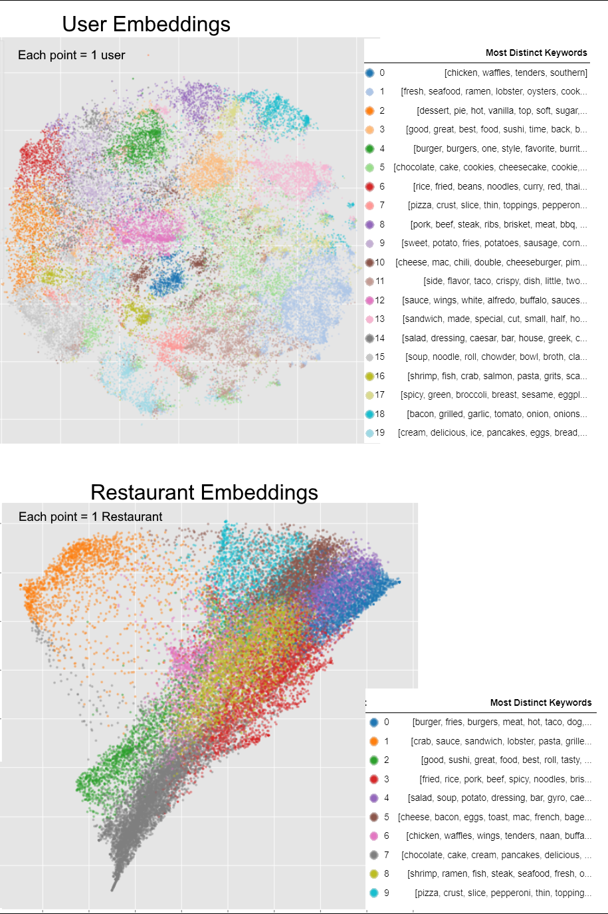
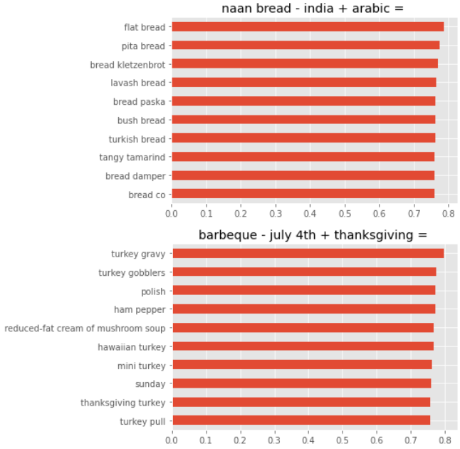

# Food Recommendation Data Science Project

 
* **We can recommend a user of user-group 7 (pizza-lovers), to a restaurant of restaurant-group 9 (pizzarias). Or dessert lovers (user groups 2, 5, 19) to dessert restaurants (restaurant-group 7). Or seafood-lovers (user-groups 1, 16) to seafood restaurants (restaurant-group 8).**

[(Click here for a more in-depth and ML-technical description of this project!)](/food_recommendation_technical.md)

[(Link to Github Repo)](https://github.com/benduong2001/Food-Recommendation)

* This independent data science project of mines, explores food related datasets (unstructured text data) for prediction data analysis tasks involving customer recommendation. Two sub-projects were done.
    * The 1st sub-project is building a classification model that uses the textual contents of a customer's review to predict if they rate the restaurant favorably or not. 
    * The 2nd sub-project is building an auto-recommender model that can decide if a customer and a restaurant are compatible. The findings also help create segmentations of the customers and restaurants based on food vocabulary.
* This project will show:
   * Data Analysis and results applicable to useful business questions on customer recommendation, such as providing insights to user demographic sub-groups.
   * Succinct and Intuitive Data visualizations

* Used Tools (Everything is done in Python)
  * Scikit-learn (for TfIdf Vectorizer and Logistic Regression)
  * Matplotlib for visualizations
  * Pandas
  * NumPy
  * Tensorflow and Keras

### Sub-Project 1

* With Python, I program a textual classification machine learning model on predicting whether a given user will rate a given restaurant negatively, with their text reviews as input data.
* [Click here to see the full "sub-project" 1](https://benduong2001.github.io/food_recommendation_part1.html)
* After dataset training, the model was able to determine whether a customer review was positive or negative with a 80% accuracy, and even reveals the 20 most influential words that would appear in a review for anticipating the customer satisfaction, shown above. As seen, it sensibly finds emotional words. But it also picks up words that are otherwise neutral but could be negative in the context of food (like "burnt") or even restaurant service itself (like "slow").

 

## Sub-Project 2

* Task 2 is about predicting whether a given user likely would visit a given restaurant, using text and images as input data.
* [Click here to see the full "sub-project" 2](https://benduong2001.github.io/food_recommendation_part2.html)

 

* Gensim's Word2Vec would be used to be provide vector embeddings for the restaurants and reviewers

 

* By doing so, unsupervised ML clustering (namely K-means) via Python's Scikit-Learn can be used to automate customer segmentation. This divides the reviewers into distinguishable ”cuisine” sub-groups based on their reviews’ distinct food-related keywords (the same applies to the businesses)
* For data visualization purposes, the data undergoes dimensionality reduction as seen below to enable a 2D scatterplot.
 

* During the data preparation, I was also able to uncover indirectly-associated sub-groups in the restaurants and customer demographics, based on food, which in itself is a useful and applicable byproduct. **Because with this, we can recommend a user of user-group 0 (dessert-lovers), to a restaurant of restaurant-group 7 (dessert restaurants)**
