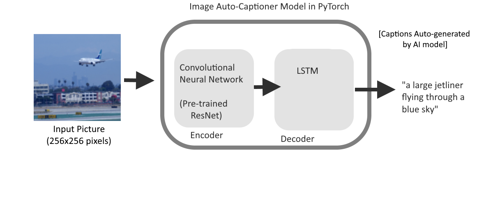

# About Me

Hello, I am **Benson Duong**. I am a Data Science student at the University of California, San Diego, learning about the fields of data science, programming, analysis, statistics, and machine learning. My projects and work have a recurring interest in social data, looking into business data or map data.

I program with Python, using it to automate tasks and perform my data science work. I also work with SQL and Tableau, and have used Excel. Other none data-science related languages or tools that I work with include JavaScript, Java, Git Bash, Docker.

[Resume](BensonDuongLtxResumeV13.pdf)

These are some of my projects. Some are school assignments. Others are independent.
Because of academic policy, some of my school projects do not link their code and have privated github repo's, and I can only provide surface-level descriptions of what I had done, within permitted limits.

# Data Science Project Portfolio

---
### [School] Industry Research Capstone Project*(Fall 2022 - Winter 2023)*
[Industry Research Capstone](capstoneproject.md)

---

---
### Restaurant User Recommendation Project *(Fall 2022)*
[Food Recommendation Data Science Project](food_recommendation.md)

---

---
### NYC Traffic Geospatial Project *(Fall 2021 - Summer 2022)*
[NYC Traffic Data Science Project](nyc_traffic_project.md)

---

---
### [School] ArcGIS Airbnb Listings Project *(Winter 2023)*
[ArcGIS Airbnb Listings Project](airbnb_sd.md)

---

---
### [School] AI Image Auto-Captioner Project with PyTorch *(Fall 2022)*
[AI Image Auto-Captioner PyTorch Project with PyTorch](cse151b.md)

---

---
### [School] Pyspark Text-based Customer Satisfaction Data Engineering Project *(Winter 2022)*
[Pyspark Text-based Customer Satisfaction Data Engineering Project](dsc102.md)
---

Pages: **1**,   [2](index_pg2.md)
