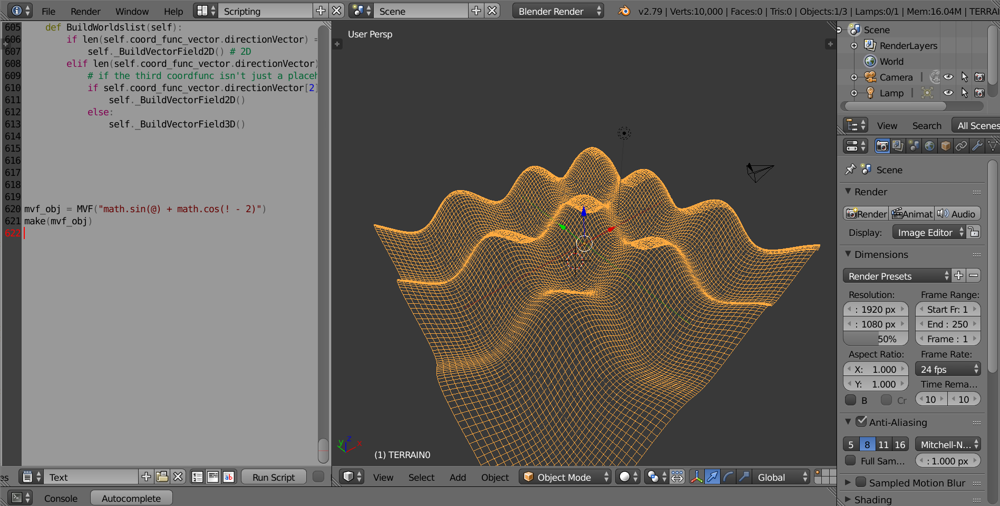

# Data Science Project Portfolio [Page 2]

---
### Font Style Image Project *(Spring 2022)*
[Font Style Image Data Science Project](typography.md)

---

---
### - DSC80 Power Outage Data Science Project *(Spring 2021)*
[DSC80 Power Outage Data Science Project](dsc80.md)

---

---
### - ArcGIS San Francisco Steepness & Wheelchair Accessibility Project *(Winter 2021)*
[ArcGIS San Francisco Steepness & Wheelchair Accessibility Project](usp4.md)

---

---
### Remaking Image Recognition ML from Scratch *(Spring 2020)*
[Remaking Image Recognition ML from Scratch](homemadetf.md)

---

---
### Python 3D Grapher Tool for Vector Calculus in Blender 3D *(Spring 2020)*
[Python 3D Grapher Tool for Vector Calculus in Blender 3D](blector.md)

---

Pages: [1](index.md),   **2**
