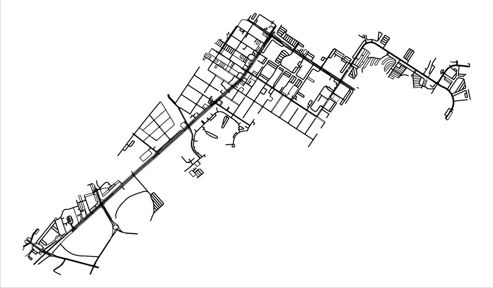

# Lyft Motion Prediction Project

# Table of Contents
- [Background](https://benduong2001.github.io/lyft.html#Background)
- [Dataset](https://benduong2001.github.io/lyft.html#Dataset)
- [Data-Analysis](https://benduong2001.github.io/lyft.html#Data-Analysis)
- [Model](https://benduong2001.github.io/lyft.html#Prediction)
- [Visualizations](https://benduong2001.github.io/lyft.html#Visualizations)
- [Presentation](https://benduong2001.github.io/lyft.html#Presentation)

## Background {#Background}

* I was part of a team research project team spanning 6 months from October 2020 to March 2021, as part of the UCSD Data Science student organization. We analyzed a motion-tracking dataset of Lyft's self-driving AI vehicles, and devised machine learning model processes to predict its movements.

### Dataset {#Dataset}

* In this project, my team was given a 20GB dataset tracking the movements of Lyft's self-driving vehicle and those of its surrounding entities, as it navigated the streets of Palo Alto, CA. 
    * The dataset has many **"Scenes"**, with a **SceneID** column.
    * Each **Scene** has 248 **Frames**, with a **FrameID** column (not a true "ID" column as it resets to 0-248 in each scene)
    * Each **Frame** has rows for all **Entities** (the AI car, other vehicles around it, etc) observed in that frame in time, with an **EntityID** column (also not a true "ID" column as it reuses numbers 1 & up in each scene).
    * Each **entity**'s row has columns for location in x/y, velocity in x/y, yaw, physical dimensions, and "Entity category" (which only has 4 types: vehicle, pedestrian, cyclist, and "Unknown").
    * So the lowest data-level is (**SceneID**+**FrameID**+**EntityID**, or a given **entity** in a given **frame** in a given **scene**.
* Since 20GB was too much, we trimmed it down to 1GB by randomly selecting 100 scenes
* There is also 2 other data files for the crosswalks and roadmap.

## Data Analysis {#Data-Analysis}
* These are what we faced in data processing, data cleaning, and exploratory data analysis.

### Data Processing
* Originally, the entity-level rows for the AI-car and the non-AI-car entities were provided seperately in 2 tables.
* Both still had the **SceneID** & **FrameID** columns to bridge information over, but the challenge was we couldn't just stack both tables and re-order by SceneID and FrameID (like **pd.concat with axis=0** in Python or **UNION ALL** in SQL).
* The AI-car's table lacked many of the other table's columns (EntityID, x/y velocity, yaw, dimensions, and entity category), but still had x/y location (and sceneID + frameID).
    * We chose the AI car's EntityID to be 0 (the other EntityID's are always 1 or above, so EntityID-conflict is avoided)
    * We made the AI car's entity category "Vehicle", obviously.
    * We found the AI-car's physical dimensions, after searching documentation: 4.87 meters long and 1.85 meters wide
    * To fill the AI-car's x/y velocity and yaw columns, I had to write vector math and angle calculation, and account for zero-division errors. I also wrote the whole process out in **SQL** as an easier-to-read alternative (compared to Pandas syntax), and it heavily uses **Windowing with LAG**.

### Handling of Missing Data - Imputation of Unknown-Category Entities with Logistic Regression
* As said earlier, the dataset's entities are of 4 categories: Vehicle, Pedestrian, Cyclist, and "Unknown".
* I worked with another teammate to help determine if the Unknowns could be relabeled with the 3 other known categories.
* This depends on the assumption that "unknown" could be just a data-recording error, or MCAR (Missing Completely at Random), or if it is indeed things that could not be grouped as pedestrians, vehicles, or cyclists. **70%** of the data had a Unknown category.
* I went through determining if it was MCAR, MAR, or MNAR. I did Null-permutation Hypothesis Testing
* Our Process 
    * We added potentially helpful derived-columns like the entity's size (length x width), "slenderness" (ratio of length and width), speed (vector norm of x/y velocity columns)
    * We split the dataset into known and unknown.
    * In the known table, category representation was imbalanced, so we undersampled each category by the smallest category's amount. We did train-test split (75:25) and ran **Logistic Regression**.
    * The test set accuracy was very promising, and we ran the trained model on the unknown table, imputing the Unknown categories.

### Checking For Anomalies
* I wrote pandas code that filters entities with "unrealistic dimensions". 
* Max dimensions, Max Speed
* Variability in dimensions and categories

## Model
* 
