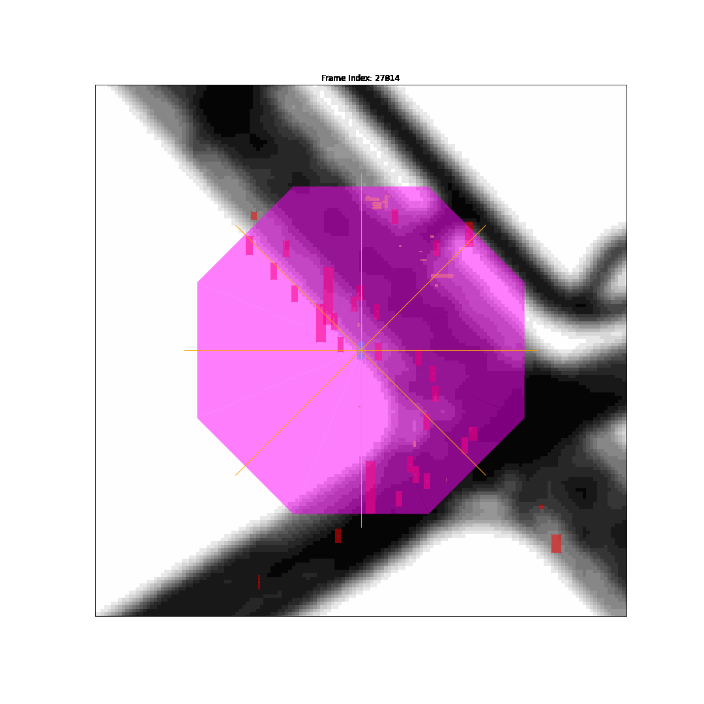
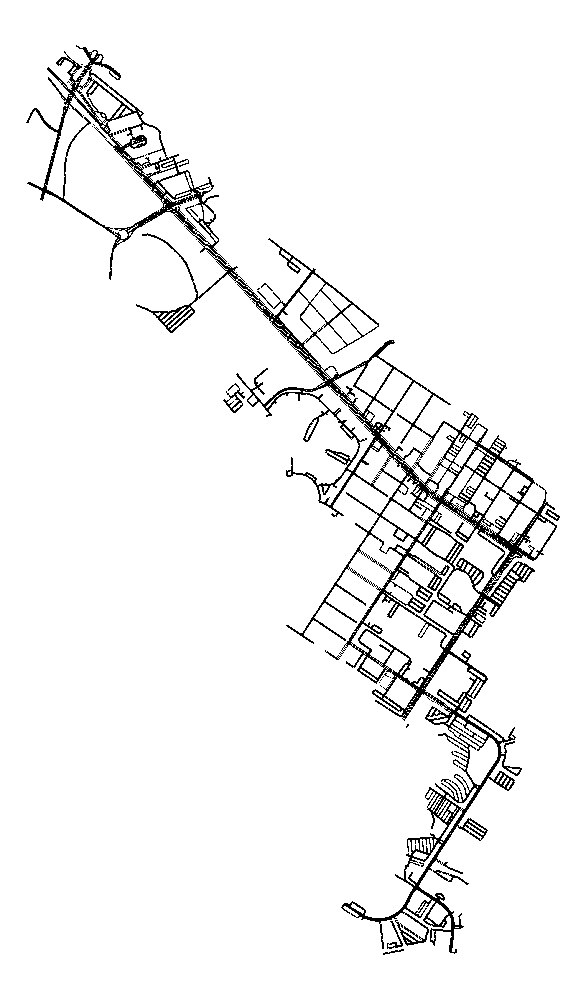

# Lyft Motion Prediction Project

I was part of a 4-member team research project spanning 6 months from October 2020 to March 2021, as part of the UCSD Data Science Student Club. 
In this project, my team was given a 20GB dataset tracking the movements and surroundings of Lyft's self-driving vehicle as it navigated the streets of Palo Alto, CA.

# Table of Contents
- [Background](https://benduong2001.github.io/airbnb_sd.html#Background)
- [Airbnb Price Prediction](https://benduong2001.github.io/airbnb_sd.html#Airbnb-Price-Prediction)
- [Analyzing Airbnb Prices based on Distance from Landmarks](https://benduong2001.github.io/airbnb_sd.html#Landmark-Radius)
- [Map Visualizations](https://benduong2001.github.io/airbnb_sd.html#Map-Visualizations)

