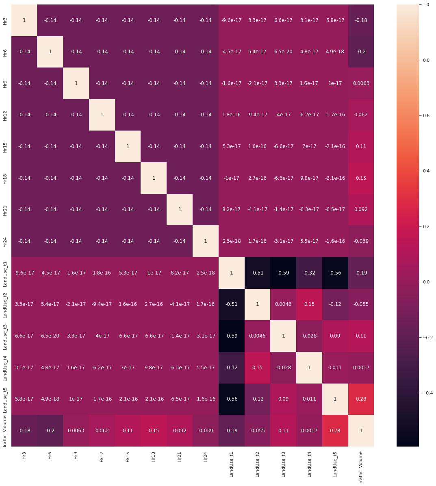

# Geospatial Data Science Project: New York City Traffic

## Table of Contents
- [Background](https://benduong2001.github.io/nyc_traffic_project.html#Background)
- [Esri ArcMaps Geodata Preprocessing](https://benduong2001.github.io/nyc_traffic_project.html#ArcGIS-Data-Preprocessing)
- [Data Analysis and Visualizations](https://benduong2001.github.io/nyc_traffic_project.html#Data-Analysis)

## Background {#Background}

 
* Demonstration of Traffic Prediction App made with Flask and Leaflet.js

This GIS data science project is an exploration of traffic volume statistics in New York City. It is an independent project that I've worked since Fall 2021.
It contains 2 parts:
* A Python App that can predict traffic volume level in NYC given the street and time of day, with a clickable roadmap and clock input (shown above); it uses geopandas for GIS data preprocessing, Flask for the web framework, and Leaflet.js for the front-end geography interactiveness. Various models can be employed, with accuracies between 75 % to 90 %
* A Kaggle article that I wrote, giving a tutorial on how to replicate the project (without cosmetics) using ArcGIS (the industry standard software for GIS data analysis). In addition, it provides various exploratory data analysis, including line plots of traffic volume across time of day according to various factors, and hypothesis testing such as ANOVA.

### **Github Repo to App built on Flask and Leaflet.js (seen in gif above)**:  
[(Click to view Repo)](https://github.com/benduong2001/nyc_traffic_flask)

### **Kaggle Article that I wrote**: 
[(Click to view article)](https://www.kaggle.com/code/bensonduong/geospatial-nyc-traffic-project)

## ArcGIS-Data-Preprocessing {#ArcGIS-Data-Preprocessing}

Preprocessing

### Part 1A: *Getting the Street Segment Traffic Data into a GIS-friendly Format*

Opening the traffic CSV file (made from the code before) on ArcMap, you'll come across the first problem. **It's an ordinary CSV file, with no usable geospatial data formatting**. The closest column we have are the street names, which we don't really want to resort to, since string data like this can be wildly inconsistent from one data source to another (East 73rd Street in one data source might be 73 St. E in another).

But there's no reason to panic. Luckily, the metadata for that traffic CSV file shows that the column "Segment ID" is an identifier for each street segment. After some internet sleuthing, you will eventually find an online data source with a name like "nyc_lion" (the second base dataset), which has extensive data on NYC street segments, including a column with the exact same identifier. Most importantly, it includes shapefiles that will allow us to use geospatial data.

* Download the nyclion dataset, and open up it on ArcMaps. 
* Drag the "lion" layer into ArcMaps from the catalog. This will show a comprehensive polyline street map of New York City. This is the only layer we will actually need from nyclion; the rest of the data folder wastes up a lot of storage, so export the lion layer as a lone shape file and delete the other stuff. Now, we just have the lion shapefile, and the traffic csv.

 

Now, we must do a join between the shapefile dataframe and the csv dataframe on the foreign key Segment ID. But there's a side-issue that must be resolved first. In the traffic csv layer, the Segment ID's type is a long integer. Meanwhile, in the lion shapefile layer, the Segment ID is a 7-character string that's zero-padded in the front. This formatting difference will ruin the join.

This can be resolved by making a new column with the correctly formatted segment ID. 
* Add a new 7-digit, long-integer field to the dataframe of the lion shapefile layer with the name "Segment_ID"
* Use the field calculator to convert that string column to a long integer. 
* I used the python calculator, and used the code int(!SegmentID!).

Now we can go ahead with the join. But after running, you'll notice a problem: ArcGIS's inbuilt join tool will only treat it as one-to-one, keeping only the first matching row it finds for each street segment, and ignoring the duplicate rows after. This means that each street segment row will have just the first hour of the day, rather than all of them. This is bad, because it needs to be a one-to-many join, because each street segment has many rows describing its traffic volume at different times of the day. **However, we won't delete this failed join layer**. It will be useful later, so rename it as something like "OneToOneJoin" and tuck it away for now.

According to Esri, going to ArcToolbox > Layers and Table Views > Make Query Table will provide an alternative join tool that resolves one-to-many. However, this method did not work for me, so I'll provide another way. According to this forum post: https://gis.stackexchange.com/questions/177506/one-to-many-joins-on-a-feature-class-to-a-table, to do a one-to-many join:

* Create a file geodatabase in the ArcMap file.
* From the geodatabase, import the 2 main layers from earlier, which are the lion shp file (as a feature class (single)), and the traffic csv file (as a table (single)).
* Finally, using those 2, imported layers within the geodatabase, perform a join with ArcGIS's regular inbuilt join tool.
* The resulting layer (which I renamed to "gdb_join") will deceptively appear the same as the first failed One-to-One join Layer.
* But, once this layer gets exported as a shp.file and then re-added back into the ArcMap file, it will show all the hours for each street segment, i.e. a proper one-to-many join.

That final, resulting join layer ("gdb_join") should appear like this (It does not need to be green). All the other layers were hidden and a BaseMap was added underneath to show the purpose of this join.

 

In summary, for the 1st base dataset listed at the beginning, we had to join it with the 2nd base dataset, so that its street segment traffic data could be geospatially usable and visually seen when loaded up onto ArcMap.

 

### Part 1B: *Retrieval of Geospatial Data Surrounding the Street Segments*

We could move onto data-cleaning and wrap up ArcGIS, but we could also go a bit further. So far, we have data on **time** (hourly traffic data) and **place** (street segment), which are very useful for analyzing traffic. But could **place** be improved? Specifically, could more be done to learn about a street segment's **surroundings** and **local environment**?

Environmental context can imply a lot about the traffic volume; for example, if the street segment's **local surrounding area** is mostly residential, like say, Queens or Staten Island, you likely won't see noisy urban traffic.

* But the issue is definining the **local surrounding area** that a street segment falls within. NYC has many subdivision types as options like census tract, zip code, community districts (CT), neighborhood tabulation areas (NTA), even congressional districts and school districts.
* But, ... the issue is that these options will all lead to the **Modifiable Areal Unit Problem**; they are are human-created, and thus unequally shaped and sized, and overall arbitrary.
* A better, un-biased solution is to define the "surrounding area" as a region drawn around the street segment at a certain radius. For example, 500 feet.

This is the goal of Part 1B:
* For each of the street segments in the gdb_join dataframe,
* Draw  a region that's X distance radius around the street segment (which I chose X as 500 ft, but its up to personal choice)
* That way, later on in the project, we can gather up all data on the buildings/land-parcels within that region to form statistics for that street segment.

* First, load the 3rd dataset, which has the name mappluto. 
* Rename this shapefile layer as "LandUse". 

Zooming in, the LandUse shapefile layer (pink) represents the parcels and lots on each city-block. The lion shapefile layer (dark red), and the new gdb_join shapefile layer (bright green) are also shown.

 

Remember that "failed" OneToOneJoin shapefile layer created back then? This is when it gets used again.
Use the Geoprocessing > Buffer Tool with the following parameters:
* Input Features: the "failed" one-to-one join layer from earlier.
* Distance [value or field]: set to 500, with units as Feet (This radius is arbitrary)
* Dissolve: None

Run the buffer tool, and rename the resulting layer as "StreetSegmentBlobs". You should have a result like this: These "blobs" are the area 500ft around the the street segment. The reason that the "Failed join" layer ("OneToOneJoin" layer) was used is to avoid having redundant "blobs" stacked onto each other; only 1 is necessary for each street segment.

Next, use the Geoprocessing > Clip tool with the following parameters:
* Input Features: the new LandUse dataframe layer
* Clip Features: the StreetSegmentBlobs Layer from the last step

Run the Clip tool, which might take a while. Name the new clipped layer as StreetSegment_LandUse_Clipped.

 

Finally, use the Customize > ArcToolbox > Analysis Tools > Overlay > Spatial Join tool with the following parameters:
* Target Features: the LandUse_StreetSegmentBlobs_Clipped layer
* Join Features: the StreetSegmentBlobs layer
* Join Operation: One to Many
* Match Option: Intersect

Name the resulting layer as StreetSegment_LandUse_Subsets, and export the dataframe of it to a txt file for later use as a CSV.

## Data Analysis and Visualizations {#Data-Analysis}

**Stacked Barcharts showing Landuse Compositions across NYC Boroughs**

 

* Unsurprisingly, Manhattan has the most Business landuses and least Residential landuses. Brooklyn, Staten Island, and Queens are the more residential and "suburban" boroughs of NYC, and so it has a higher percentage of residential landuses.

**Lineplots showing Traffic Volume over Weekday-types, Boroughs, and Landuses**

 

 

 

* The traffic volume throughout the day tends to follow a consistent pattern.

**3D Scatterplot in terms of Traffic Volume (color), Subway Entrance Proximity, and Building Floor Count**

 

* It is insightful to consider how a street segment's traffic volume is correlated with Proximity to Subway Entrances and how "urbanized" the surroundings are (as symbolized by building floor count for skyscrapers).

<!--
 

 

 

 

 

 

 

 

 

 
-->

**Correlation Heatmap**

 

**Multinomial Logistic Regression Prediction Model's Confusion Matrix**

 

**Feature Importances of the Multinomial Logistic Regression Prediction Model**

 
