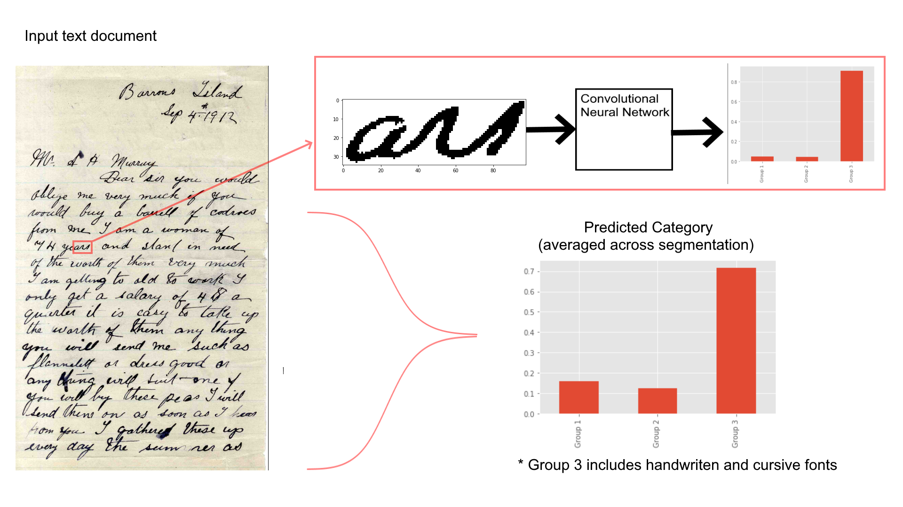
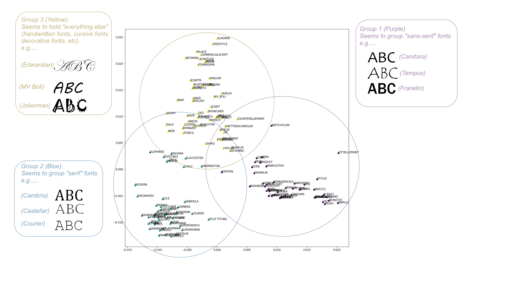

# Typography Image Data Science Project
This image data science project is a personal practice of unstructured image data. Much like the traffic project, I found the data first and that decided the project's direction. The dataset is images of all english alphabet letters and symbols in varying fonts. 

**All of this is part of a Kaggle article tutorial that I authored.**

 
## Convolutional Neural Network

The final endproduct of the project is an image classification model that can take in photo-scanned text documents, and automatically categorize the type of font most prevalent in the document. It will involve a convolutional neural network of variable input size, meaning it can take in images of varying dimensions.

 
## Unsupervised Methods and Clustering

The font types include designations like "serif", or "sans-serif", and are actually labelled groupings of various fonts with similar visual traits.
* This grouping was automatically performed using unsupervised machine learning, rather than making a person manually categorize individuals fonts by hand.
* Various unsupervised methods for dimensionality reduction were used, including PCA and Spectral Embedding, and finally k-means clustering was employed to actually group up points.

