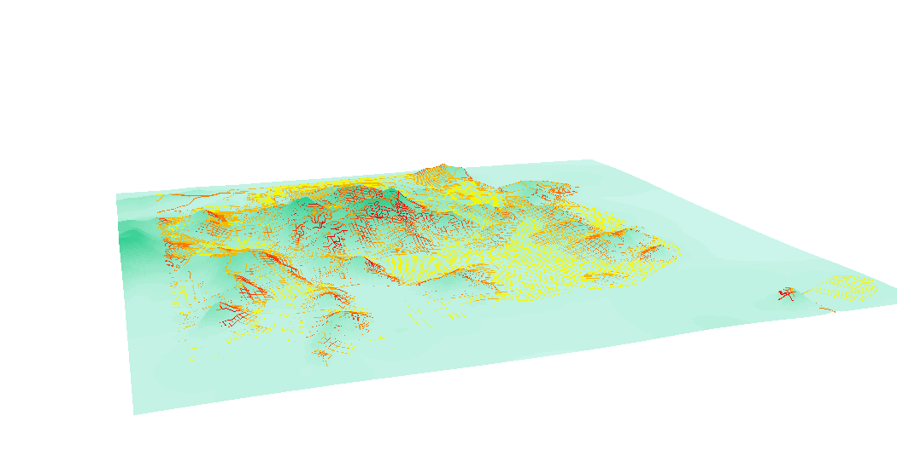
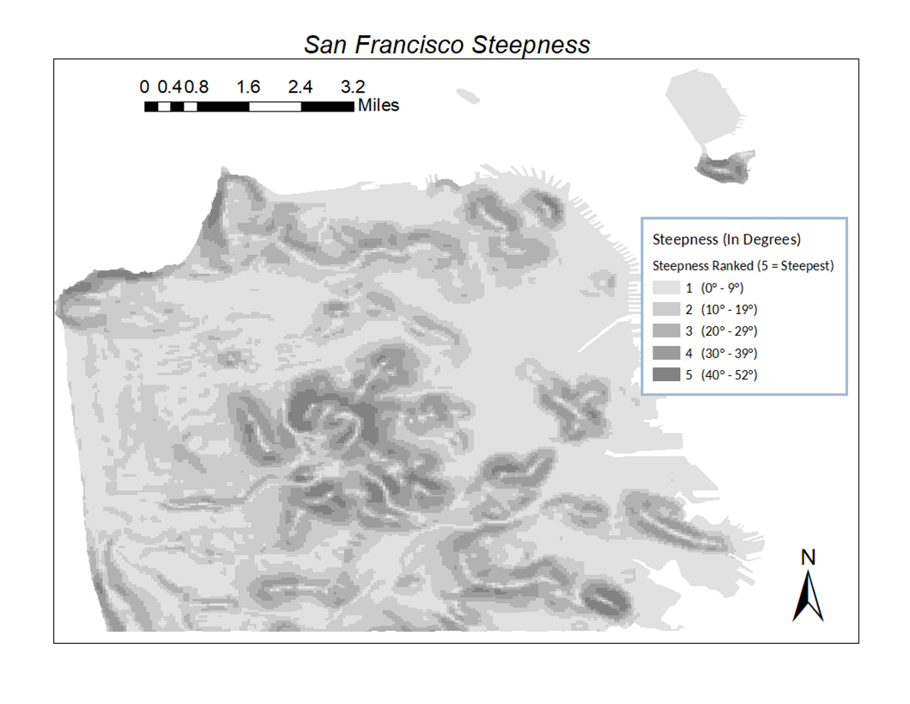
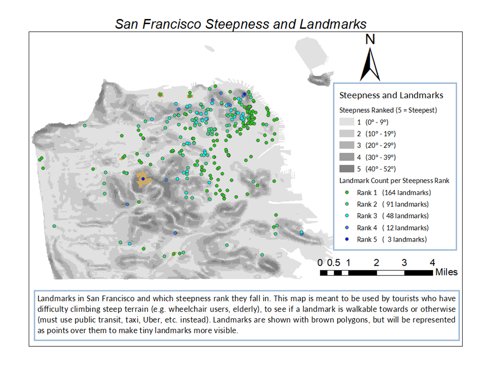
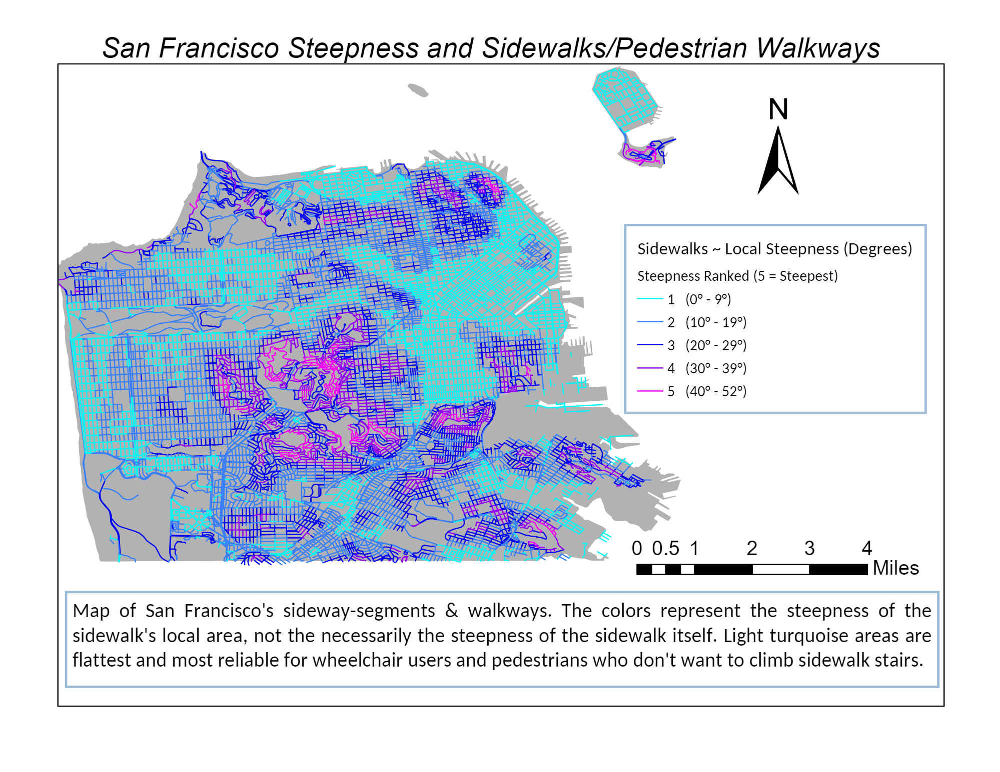
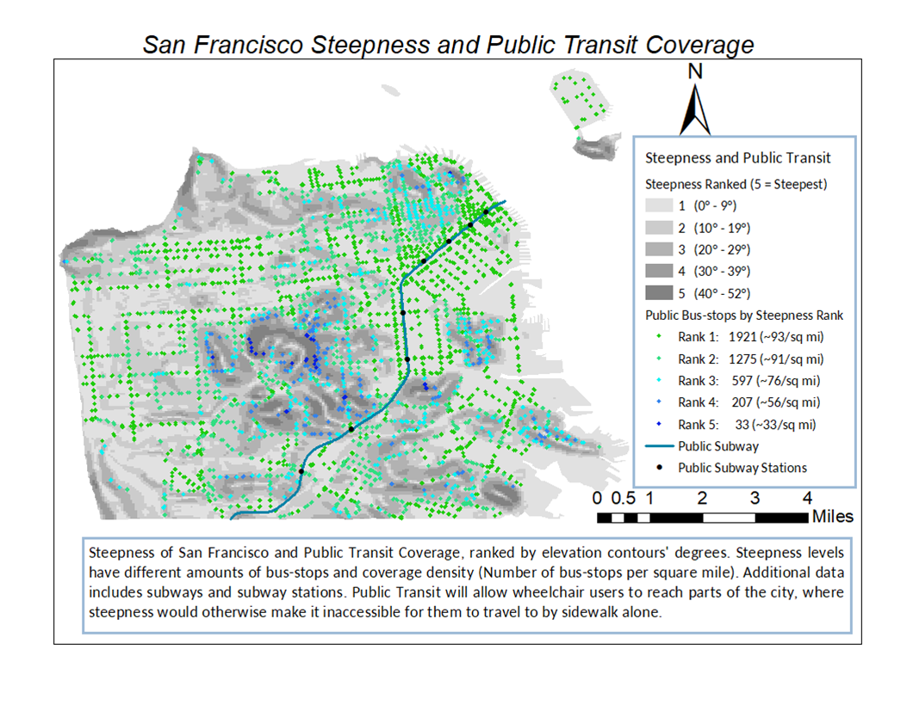

# USP4 ArcGIS San Francisco Steepness and Wheelchair Accessibility Project

[Github Repo](https://github.com/benduong2001/ArcGIS_Project_San_Francisco_Steepness/)

* This was my final project for USP4, a course at UCSD where we learned how to use ArcGIS, an industry-wide software for geospatial data analysis and science.
* For my proposed subject, I decided to explore the steep topography of San Francisco, and produce maps for the context of its sidewalk pedestrian accessibility for wheelchair users or those that have difficulty walking, such as the elderly.
    * Coverage of vehicular transportation across the city by public transit over steep areas, as an option to bypass physical walking
    * San Francisco Landmarks in steep areas, in terms of walkable accessibility for tourist

# Steepness in San Francisco: Wheelchair Acccessible?
This project was done using the GIS (Geographic Information Systems) software ArcGIS (USP4)

# Summary

San Francisco is well known for its hilly geography and steep inclines. Thus, assessing the city's topography is crucial to understanding the pedestrian wheelchair accessibility in certain parts of the city. This project is intended to provide maps that can be useful for the tourists who have difficulty navigating on steep terrain, such as the elderly, or wheelchair users. 

This project uses several complex methods in terms of spatial joining and conversion of contour line to gradients.

# Introduction
San Francisco is well-known for its hilly geography and steep streets.
Maps about its steepness will give insight about how to navigate it for tourists who have difficulty with steep terrain, like the elderly and handicapped people.

* https://data.sfgov.org/Energy-and-Environment/Elevation-Contours/rnbg-2qxw
  * An elevation contour line map of San Francisco

# Process - Base Map
* All maps were re-projected as NAD_1983_StatePlane_California_III_FIPS_0403
* Made a discrete steepness map 
  * Steepness raster conversion 
    * Topo-to-Raster
    * Slope
    * Int, Raster_to_Polygon
    * Field calculator
  * Steepness ranged from 0° to 52°
  * Categorized and Dissolved everything into 5 (multi-part) polygons for different steepness tier.

# Process - Secondary Map
* Made 3 maps on using this base map and another shape-files, using Spatial Join
  * Landmarks (Polygons)
    * Spatial Join = “Have Their Center In”
  * Sidewalks (Poly-lines)
    * Spatial Join = “Intersect”
  * Public Transit (Points and Poly-lines)
    * Spatial Join = “Within”

[See my Project Slides](images/images_usp/Wheelchair_Accessibility_San_Francisco.pdf)
